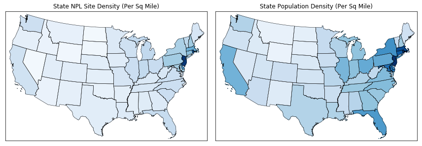
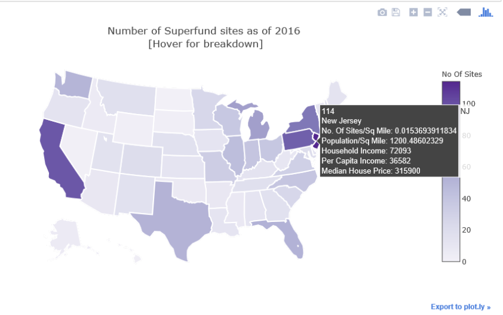
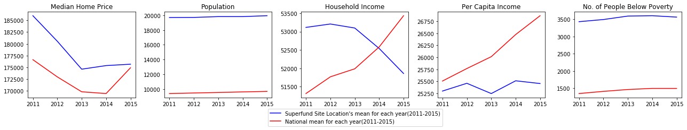
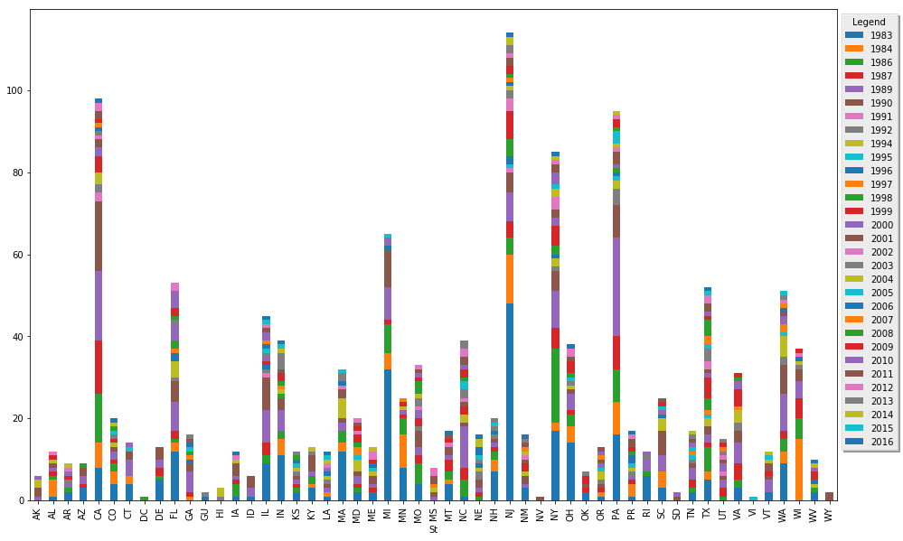
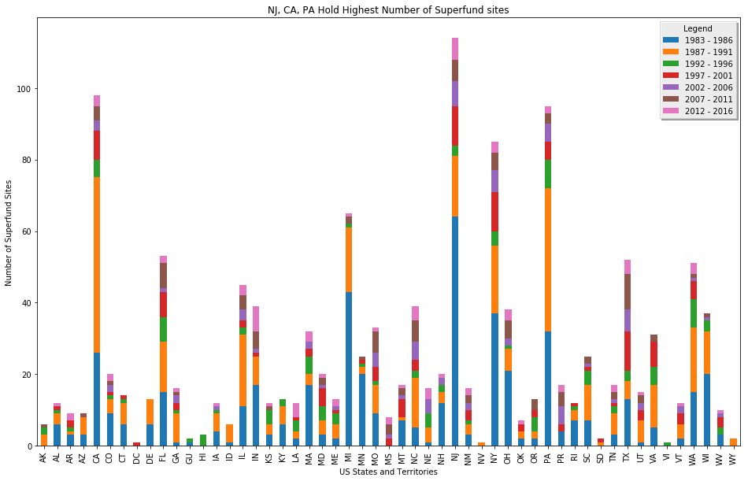
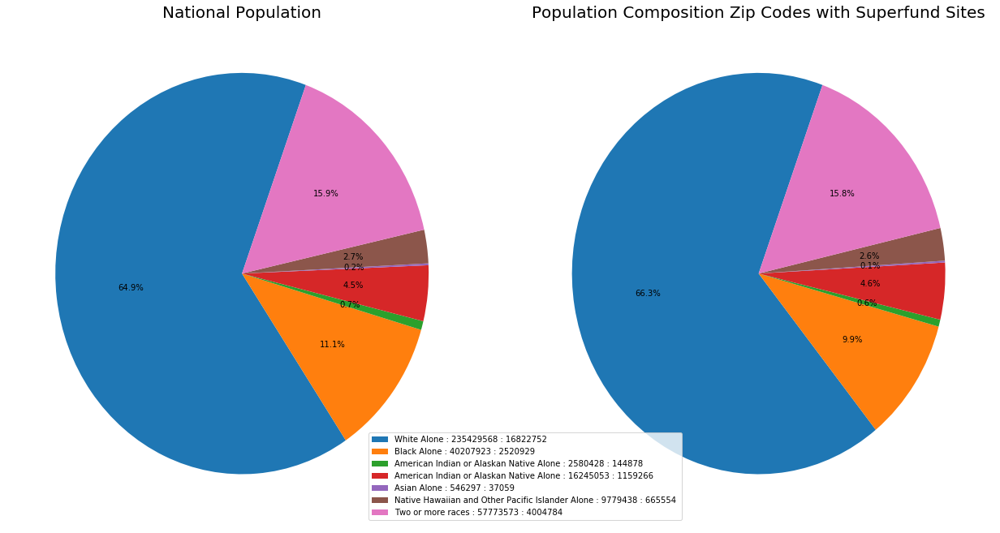

```python
from IPython.display import HTML

HTML('''<script>
code_show=true; 
function code_toggle() {
 if (code_show){
 $('div.input').hide();
 } else {
 $('div.input').show();
 }
 code_show = !code_show
} 
$( document ).ready(code_toggle);
</script>
<form action="javascript:code_toggle()"><input type="submit" value="Click here to toggle on/off the raw code."></form>''')
```


<script>
code_show=true; 
function code_toggle() {
 if (code_show){
 $('div.input').hide();
 } else {
 $('div.input').show();
 }
 code_show = !code_show
} 
$( document ).ready(code_toggle);
</script>
<form action="javascript:code_toggle()"><input type="submit" value="Click here to toggle on/off the raw code."></form>


```python
import pandas as pd
import matplotlib.pyplot as plt
import numpy as np
import requests, json, gmplot
from datetime import datetime
from census import Census
# from us import states
from resources.states import states
from resources.statesAreaInMiles import statesAreaInMiles
import scipy.stats as stats
import plotly as py
from plotly.tools import FigureFactory as FF
from mpl_toolkits.basemap import Basemap as Basemap
from matplotlib.colors import rgb2hex
from matplotlib.patches import Polygon
from matplotlib.gridspec import GridSpec
from bs4 import BeautifulSoup
from IPython.core.display import display
from IPython.display import IFrame


py.offline.init_notebook_mode(connected=True)

dt = datetime.today().strftime('%m-%d-%y')
# Extract API key from external json file
keyPairs = open('../../keys/appkey.json')
keyPairs_json = json.load(keyPairs)
gkey = keyPairs_json['gkey']
censuskey = keyPairs_json['censuskey']

```


<script>requirejs.config({paths: { 'plotly': ['https://cdn.plot.ly/plotly-latest.min']},});if(!window.Plotly) {{require(['plotly'],function(plotly) {window.Plotly=plotly;});}}</script>


## Extract Superfund Sites - NPL data into a DataFrame


```python
sf = pd.read_csv("resources/superfunddata.csv" , dtype={'Zip': str}) #, "Latitude":float
sf["Latitude"] = sf["Latitude"].str.decode("unicode_escape")
sf["Longitude"] = sf["Longitude"].str.decode("unicode_escape")
sf["Latitude"] = sf["Latitude"].str.encode("ascii", "ignore")
sf["Longitude"] = sf["Longitude"].str.encode("ascii", "ignore")
# delete empty rows at end of file
sf.drop(sf.index[[1336,1337]], inplace=True)
sf["Converted Date"] = ""
for index, row in sf.iterrows():
    sf.set_value(index, "Converted Date", datetime.strptime(row["Final Date"], '%m/%d/%y'))
sf["Year"]=""
for index, row in sf.iterrows():
    sf.set_value(index, "Year", row["Converted Date"].year)
sf.head()
```


<div>
<style>
    .dataframe thead tr:only-child th {
        text-align: right;
    }

    .dataframe thead th {
        text-align: left;
    }

    .dataframe tbody tr th {
        vertical-align: top;
    }
</style>
<table border="1" class="dataframe">
  <thead>
    <tr style="text-align: right;">
      <th></th>
      <th>Reg</th>
      <th>St</th>
      <th>Site Name</th>
      <th>Unnamed: 3</th>
      <th>Site ID</th>
      <th>EPA ID</th>
      <th>Address</th>
      <th>City</th>
      <th>Zip</th>
      <th>County</th>
      <th>Unnamed: 10</th>
      <th>Unnamed: 11</th>
      <th>FF?</th>
      <th>Latitude</th>
      <th>Longitude</th>
      <th>Final Date</th>
      <th>Unnamed: 16</th>
      <th>Unnamed: 17</th>
      <th>Converted Date</th>
      <th>Year</th>
    </tr>
  </thead>
  <tbody>
    <tr>
      <th>0</th>
      <td>‭01‬</td>
      <td>CT</td>
      <td>BARKHAMSTED-NEW HARTFORD LANDFILL</td>
      <td>NaN</td>
      <td>‭0100255‬</td>
      <td>CTD980732333</td>
      <td>ROUTE 44</td>
      <td>BARKHAMSTED</td>
      <td>06063</td>
      <td>LITCHFIELD</td>
      <td>NaN</td>
      <td>NaN</td>
      <td>N</td>
      <td>b'+41.980550'</td>
      <td>b'-073.047220 '</td>
      <td>10/04/89</td>
      <td>NaN</td>
      <td>NaN</td>
      <td>1989-10-04 00:00:00</td>
      <td>1989</td>
    </tr>
    <tr>
      <th>1</th>
      <td>‭01‬</td>
      <td>CT</td>
      <td>BEACON HEIGHTS LANDFILL</td>
      <td>NaN</td>
      <td>‭0100180‬</td>
      <td>CTD072122062</td>
      <td>BLACKBERRY HILL ROAD</td>
      <td>BEACON FALLS</td>
      <td>06403</td>
      <td>NEW HAVEN</td>
      <td>NaN</td>
      <td>NaN</td>
      <td>N</td>
      <td>b'+41.431950'</td>
      <td>b'-073.035280 '</td>
      <td>09/08/83</td>
      <td>NaN</td>
      <td>NaN</td>
      <td>1983-09-08 00:00:00</td>
      <td>1983</td>
    </tr>
    <tr>
      <th>2</th>
      <td>‭01‬</td>
      <td>CT</td>
      <td>DURHAM MEADOWS</td>
      <td>NaN</td>
      <td>‭0100108‬</td>
      <td>CTD001452093</td>
      <td>124 MAIN ST</td>
      <td>DURHAM</td>
      <td>06422</td>
      <td>MIDDLESEX</td>
      <td>NaN</td>
      <td>NaN</td>
      <td>N</td>
      <td>b'+41.481110'</td>
      <td>b'-072.681380 '</td>
      <td>10/04/89</td>
      <td>NaN</td>
      <td>NaN</td>
      <td>1989-10-04 00:00:00</td>
      <td>1989</td>
    </tr>
    <tr>
      <th>3</th>
      <td>‭01‬</td>
      <td>CT</td>
      <td>GALLUP'S QUARRY</td>
      <td>NaN</td>
      <td>‭0100201‬</td>
      <td>CTD108960972</td>
      <td>ROUTE 12</td>
      <td>PLAINFIELD</td>
      <td>06374</td>
      <td>WINDHAM</td>
      <td>NaN</td>
      <td>NaN</td>
      <td>N</td>
      <td>b'+41.665280'</td>
      <td>b'-071.924160 '</td>
      <td>10/04/89</td>
      <td>NaN</td>
      <td>NaN</td>
      <td>1989-10-04 00:00:00</td>
      <td>1989</td>
    </tr>
    <tr>
      <th>4</th>
      <td>‭01‬</td>
      <td>CT</td>
      <td>KELLOGG-DEERING WELL FIELD</td>
      <td>NaN</td>
      <td>‭0100252‬</td>
      <td>CTD980670814</td>
      <td>NORWALK WATER DEPARTMENT</td>
      <td>NORWALK</td>
      <td>06856</td>
      <td>FAIRFIELD</td>
      <td>NaN</td>
      <td>NaN</td>
      <td>N</td>
      <td>b'+41.130550'</td>
      <td>b'-073.431950 '</td>
      <td>09/21/84</td>
      <td>NaN</td>
      <td>NaN</td>
      <td>1984-09-21 00:00:00</td>
      <td>1984</td>
    </tr>
  </tbody>
</table>
</div>


## Extract number of NPL sites per State


```python
sitesPerState = sf.groupby('St').count()
sitesPerState = sitesPerState.reset_index()
sitesPerState = sitesPerState[['St','Reg']]
sitesPerState = sitesPerState.rename(columns= {'St':'Code','Reg':'No. Of NPL Sites'})
for state in states:
    if state not in sitesPerState['Code'].tolist():
        nxtIdx = len(sitesPerState)
        sitesPerState.set_value(nxtIdx, 'Code', state)
        sitesPerState.set_value(nxtIdx, 'No. Of NPL Sites', 0)

sitesPerState['Name'] = sitesPerState['Code'].map(states.get)
sitesPerState['Area Sq Miles'] = sitesPerState['Name'].map(statesAreaInMiles.get)
sitesPerState['No. Of Sites Per Sq Miles'] = sitesPerState['No. Of NPL Sites'].astype('float') / sitesPerState['Area Sq Miles'].astype('float')
sitesPerState.dropna(inplace=True)
sitesPerState.head()
```


<div>
<style>
    .dataframe thead tr:only-child th {
        text-align: right;
    }

    .dataframe thead th {
        text-align: left;
    }

    .dataframe tbody tr th {
        vertical-align: top;
    }
</style>
<table border="1" class="dataframe">
  <thead>
    <tr style="text-align: right;">
      <th></th>
      <th>Code</th>
      <th>No. Of NPL Sites</th>
      <th>Name</th>
      <th>Area Sq Miles</th>
      <th>No. Of Sites Per Sq Miles</th>
    </tr>
  </thead>
  <tbody>
    <tr>
      <th>0</th>
      <td>AK</td>
      <td>6.0</td>
      <td>Alaska</td>
      <td>571951.26</td>
      <td>0.000010</td>
    </tr>
    <tr>
      <th>1</th>
      <td>AL</td>
      <td>12.0</td>
      <td>Alabama</td>
      <td>50744.00</td>
      <td>0.000236</td>
    </tr>
    <tr>
      <th>2</th>
      <td>AR</td>
      <td>9.0</td>
      <td>Arkansas</td>
      <td>52068.17</td>
      <td>0.000173</td>
    </tr>
    <tr>
      <th>3</th>
      <td>AZ</td>
      <td>9.0</td>
      <td>Arizona</td>
      <td>113634.57</td>
      <td>0.000079</td>
    </tr>
    <tr>
      <th>4</th>
      <td>CA</td>
      <td>98.0</td>
      <td>California</td>
      <td>155959.34</td>
      <td>0.000628</td>
    </tr>
  </tbody>
</table>
</div>


## Remove unwanted/blank columns, create list of latitudes & longitudes


```python
sf.drop(['Unnamed: 3','Unnamed: 10','Unnamed: 11','Unnamed: 16','Unnamed: 17'], axis=1,inplace=True)
sfFilterLatLon = sf.copy()
sfFilterLatLon.drop(sfFilterLatLon.index[[756,1104]], inplace=True)
sfFilterLatLon.dropna(subset=[['Latitude','Longitude']],inplace=True)
sfFilterLatLon.reset_index(inplace=True)
latitudes = pd.to_numeric(sfFilterLatLon['Latitude'])
longitudes = pd.to_numeric(sfFilterLatLon['Longitude'])
sfFilterLatLon['Site Name'] = sfFilterLatLon['Site Name                                                                ']
sitename = sfFilterLatLon['Site Name'].tolist()
```

## Extract Census data for 2015 for all US zip codes


```python
c = Census(censuskey, year=2015)
censusByZipCd2015 = c.acs5.get(("NAME", "B19013_001E", "B19301_001E", "B23025_002E", "B23025_007E", "B23025_003E", "B23025_004E", "B23025_005E", "B23025_006E", "C24010_003E", "C24010_004E", "C24010_005E", "C24010_006E", "C24010_007E", "C24010_008E", "C24010_009E", "C24010_010E", "C24010_011E", "C24010_012E", "C24010_013E", "C24010_014E", "C24010_015E", "C24010_016E", "C24010_017E", "C24010_018E", "C24010_019E", "C24010_020E", "C24010_021E", "C24010_022E", "C24010_023E", "C24010_024E", "C24010_025E", "C24010_026E", "C24010_027E", "C24010_028E", "C24010_029E", "C24010_030E", "C24010_031E", "C24010_032E", "C24010_033E", "C24010_034E", "C24010_035E", "C24010_036E", "C24010_037E", "C24010_039E", "C24010_040E", "C24010_041E", "C24010_042E", "C24010_043E", "C24010_044E", "C24010_045E", "C24010_046E", "C24010_047E", "C24010_048E", "C24010_049E", "C24010_050E", "C24010_051E", "C24010_052E", "C24010_053E", "C24010_054E", "C24010_055E", "C24010_056E", "C24010_057E", "C24010_058E", "C24010_059E", "C24010_060E", "C24010_061E", "C24010_062E", "C24010_063E", "C24010_064E", "C24010_065E", "C24010_066E", "C24010_067E", "C24010_068E", "C24010_069E", "C24010_070E", "C24010_071E", "C24010_072E", "C24010_073E", "B17001_002E", "B17001_003E", "B17001_017E", "B17001A_002E", "B17001B_002E", "B17001C_002E", "B17001D_002E", "B17001E_002E", "B17001G_002E", "B17001I_002E", "B17012_002E", "B17012_003E", "B17012_009E", "B17012_014E", "B01002_001E", "B01002_002E", "B01002_003E", "B01003_001E", "B02001_002E", "B02001_003E", "B02001_004E", "B02001_005E", "B02001_006E", "B02001_008E", "B03001_003E", "B25035_001E", "B25058_001E", "B25064_001E", "B25077_001E", "B25088_002E", "B08136_003E", "B08136_004E", "B08136_007E", "B08136_011E", "B08136_012E", "B08301_001E", "B08301_003E", "B08301_004E", "B08301_010E", "B08301_019E", "B08101_041E", "B15003_002E", "B15003_017E", "B15003_018E", "B15003_021E", "B15003_022E", "B15003_023E", "B15003_024E", "B15003_025E", "B16001_002E", "B16001_003E", "B16001_006E", "B16001_009E", "B16001_012E", "B16001_015E", "B16001_018E", "B16001_021E", "B16001_030E", "B16001_033E", "B16001_036E", "B16001_039E", "B16001_045E", "B16001_048E", "B16001_051E", "B16001_054E", "B16001_057E", "B16001_066E", "B16001_069E", "B16001_072E", "B16001_075E", "B16001_078E", "B16001_081E", "B16001_084E", "B16001_087E", "B16001_093E", "B16001_099E", "B16001_105E", "B16001_108E", "B16001_111E"), {'for': 'zip code tabulation area:*'})
censusByZipCd2015_df = pd.DataFrame(censusByZipCd2015)
censusByZipCd2015_df.head()
```


<div>
<style>
    .dataframe thead tr:only-child th {
        text-align: right;
    }

    .dataframe thead th {
        text-align: left;
    }

    .dataframe tbody tr th {
        vertical-align: top;
    }
</style>
<table border="1" class="dataframe">
  <thead>
    <tr style="text-align: right;">
      <th></th>
      <th>B01002_001E</th>
      <th>B01002_002E</th>
      <th>B01002_003E</th>
      <th>B01003_001E</th>
      <th>B02001_002E</th>
      <th>B02001_003E</th>
      <th>B02001_004E</th>
      <th>B02001_005E</th>
      <th>B02001_006E</th>
      <th>B02001_008E</th>
      <th>...</th>
      <th>C24010_066E</th>
      <th>C24010_067E</th>
      <th>C24010_068E</th>
      <th>C24010_069E</th>
      <th>C24010_070E</th>
      <th>C24010_071E</th>
      <th>C24010_072E</th>
      <th>C24010_073E</th>
      <th>NAME</th>
      <th>zip code tabulation area</th>
    </tr>
  </thead>
  <tbody>
    <tr>
      <th>0</th>
      <td>37.6</td>
      <td>36.5</td>
      <td>39</td>
      <td>17982</td>
      <td>16956</td>
      <td>102</td>
      <td>14</td>
      <td>0</td>
      <td>0</td>
      <td>64</td>
      <td>...</td>
      <td>14</td>
      <td>0</td>
      <td>0</td>
      <td>14</td>
      <td>125</td>
      <td>110</td>
      <td>0</td>
      <td>15</td>
      <td>ZCTA5 00601</td>
      <td>00601</td>
    </tr>
    <tr>
      <th>1</th>
      <td>39.5</td>
      <td>38.6</td>
      <td>40.3</td>
      <td>40260</td>
      <td>23144</td>
      <td>693</td>
      <td>8</td>
      <td>72</td>
      <td>0</td>
      <td>14798</td>
      <td>...</td>
      <td>15</td>
      <td>0</td>
      <td>0</td>
      <td>15</td>
      <td>376</td>
      <td>334</td>
      <td>0</td>
      <td>42</td>
      <td>ZCTA5 00602</td>
      <td>00602</td>
    </tr>
    <tr>
      <th>2</th>
      <td>39.9</td>
      <td>37.7</td>
      <td>41.4</td>
      <td>52408</td>
      <td>36177</td>
      <td>2057</td>
      <td>76</td>
      <td>655</td>
      <td>0</td>
      <td>7801</td>
      <td>...</td>
      <td>43</td>
      <td>0</td>
      <td>11</td>
      <td>32</td>
      <td>211</td>
      <td>128</td>
      <td>0</td>
      <td>83</td>
      <td>ZCTA5 00603</td>
      <td>00603</td>
    </tr>
    <tr>
      <th>3</th>
      <td>40.8</td>
      <td>41</td>
      <td>40.3</td>
      <td>6331</td>
      <td>4399</td>
      <td>151</td>
      <td>0</td>
      <td>0</td>
      <td>0</td>
      <td>126</td>
      <td>...</td>
      <td>15</td>
      <td>0</td>
      <td>0</td>
      <td>15</td>
      <td>93</td>
      <td>93</td>
      <td>0</td>
      <td>0</td>
      <td>ZCTA5 00606</td>
      <td>00606</td>
    </tr>
    <tr>
      <th>4</th>
      <td>40.2</td>
      <td>36.9</td>
      <td>42.2</td>
      <td>28328</td>
      <td>17791</td>
      <td>950</td>
      <td>0</td>
      <td>26</td>
      <td>0</td>
      <td>3355</td>
      <td>...</td>
      <td>0</td>
      <td>0</td>
      <td>0</td>
      <td>0</td>
      <td>788</td>
      <td>738</td>
      <td>15</td>
      <td>35</td>
      <td>ZCTA5 00610</td>
      <td>00610</td>
    </tr>
  </tbody>
</table>
<p>5 rows × 159 columns</p>
</div>


## Extract Census data for 2015 for all US States


```python
censusByStates2015 = c.acs5.get(("NAME", "B19013_001E", "B01003_001E", "B19301_001E", "B25077_001E"), {'for': 'state:*'})
censusByStates2015_df = pd.DataFrame(censusByStates2015)
censusByStates2015_df = censusByStates2015_df.rename(columns={"B01003_001E": "Population", 
                                                              "B19013_001E": "Household Income",
                                                              "B19301_001E": "Per Capita Income",
                                                              "B25077_001E": "Median House Price",
                                                              "NAME": "Name", "state": "State"})
censusByStates2015_df.head()
```


<div>
<style>
    .dataframe thead tr:only-child th {
        text-align: right;
    }

    .dataframe thead th {
        text-align: left;
    }

    .dataframe tbody tr th {
        vertical-align: top;
    }
</style>
<table border="1" class="dataframe">
  <thead>
    <tr style="text-align: right;">
      <th></th>
      <th>Population</th>
      <th>Household Income</th>
      <th>Per Capita Income</th>
      <th>Median House Price</th>
      <th>Name</th>
      <th>State</th>
    </tr>
  </thead>
  <tbody>
    <tr>
      <th>0</th>
      <td>733375</td>
      <td>72515</td>
      <td>33413</td>
      <td>250000</td>
      <td>Alaska</td>
      <td>02</td>
    </tr>
    <tr>
      <th>1</th>
      <td>4830620</td>
      <td>43623</td>
      <td>24091</td>
      <td>125500</td>
      <td>Alabama</td>
      <td>01</td>
    </tr>
    <tr>
      <th>2</th>
      <td>2958208</td>
      <td>41371</td>
      <td>22798</td>
      <td>111400</td>
      <td>Arkansas</td>
      <td>05</td>
    </tr>
    <tr>
      <th>3</th>
      <td>6641928</td>
      <td>50255</td>
      <td>25848</td>
      <td>167500</td>
      <td>Arizona</td>
      <td>04</td>
    </tr>
    <tr>
      <th>4</th>
      <td>38421464</td>
      <td>61818</td>
      <td>30318</td>
      <td>385500</td>
      <td>California</td>
      <td>06</td>
    </tr>
  </tbody>
</table>
</div>


## Merge Census data for States with NPL sites data per State


```python
censusStateAndSFSites = pd.merge(censusByStates2015_df,sitesPerState,on='Name')
censusStateAndSFSites['Population Density'] = censusStateAndSFSites['Population'].astype('int') / censusStateAndSFSites['Area Sq Miles'].astype('float')
censusStateAndSFSites.head()
```


<div>
<style>
    .dataframe thead tr:only-child th {
        text-align: right;
    }

    .dataframe thead th {
        text-align: left;
    }

    .dataframe tbody tr th {
        vertical-align: top;
    }
</style>
<table border="1" class="dataframe">
  <thead>
    <tr style="text-align: right;">
      <th></th>
      <th>Population</th>
      <th>Household Income</th>
      <th>Per Capita Income</th>
      <th>Median House Price</th>
      <th>Name</th>
      <th>State</th>
      <th>Code</th>
      <th>No. Of NPL Sites</th>
      <th>Area Sq Miles</th>
      <th>No. Of Sites Per Sq Miles</th>
      <th>Population Density</th>
    </tr>
  </thead>
  <tbody>
    <tr>
      <th>0</th>
      <td>733375</td>
      <td>72515</td>
      <td>33413</td>
      <td>250000</td>
      <td>Alaska</td>
      <td>02</td>
      <td>AK</td>
      <td>6.0</td>
      <td>571951.26</td>
      <td>0.000010</td>
      <td>1.282233</td>
    </tr>
    <tr>
      <th>1</th>
      <td>4830620</td>
      <td>43623</td>
      <td>24091</td>
      <td>125500</td>
      <td>Alabama</td>
      <td>01</td>
      <td>AL</td>
      <td>12.0</td>
      <td>50744.00</td>
      <td>0.000236</td>
      <td>95.195885</td>
    </tr>
    <tr>
      <th>2</th>
      <td>2958208</td>
      <td>41371</td>
      <td>22798</td>
      <td>111400</td>
      <td>Arkansas</td>
      <td>05</td>
      <td>AR</td>
      <td>9.0</td>
      <td>52068.17</td>
      <td>0.000173</td>
      <td>56.814134</td>
    </tr>
    <tr>
      <th>3</th>
      <td>6641928</td>
      <td>50255</td>
      <td>25848</td>
      <td>167500</td>
      <td>Arizona</td>
      <td>04</td>
      <td>AZ</td>
      <td>9.0</td>
      <td>113634.57</td>
      <td>0.000079</td>
      <td>58.449889</td>
    </tr>
    <tr>
      <th>4</th>
      <td>38421464</td>
      <td>61818</td>
      <td>30318</td>
      <td>385500</td>
      <td>California</td>
      <td>06</td>
      <td>CA</td>
      <td>98.0</td>
      <td>155959.34</td>
      <td>0.000628</td>
      <td>246.355646</td>
    </tr>
  </tbody>
</table>
</div>


## Plot Statewise NPL Sites density vs Population density


```python
plt.figure(figsize=(12,10))

plt.subplot(1,2,1)
m = Basemap(llcrnrlon=-119,llcrnrlat=22,urcrnrlon=-64,urcrnrlat=49,
        projection='lcc',lat_1=33,lat_2=45,lon_0=-95)
shp_info = m.readshapefile('resources/st99_d00','states',drawbounds=True)
colors={}
statenames=[]
cmap = plt.cm.Blues_r
vmin = 0.000001; vmax = censusStateAndSFSites["No. Of Sites Per Sq Miles"].max() / censusStateAndSFSites["No. Of Sites Per Sq Miles"].sum()

for shapedict in m.states_info:
    statename = shapedict['NAME']
    # skip DC and Puerto Rico and the ones which are already processed. Process all from state_list of sitesPerSt
    if ((statename not in ['District of Columbia','Puerto Rico']) and (statename not in statenames) and (statename in censusStateAndSFSites["Name"].tolist())):
        if (int(censusStateAndSFSites[censusStateAndSFSites["Name"] == statename]["No. Of NPL Sites"])) == 0:
            pop = 0.00001/censusStateAndSFSites["No. Of Sites Per Sq Miles"].sum()
        else:
            pop = float(censusStateAndSFSites[censusStateAndSFSites["Name"] == statename]["No. Of Sites Per Sq Miles"]) / censusStateAndSFSites["No. Of Sites Per Sq Miles"].sum()
        colors[statename] = cmap(1.-np.sqrt((pop-vmin)/(vmax-vmin)))[:3]
    statenames.append(statename)
ax = plt.gca() # get current axes instance
for nshape,seg in enumerate(m.states):
    # skip DC and Puerto Rico.
    if (statenames[nshape] not in ['District of Columbia','Puerto Rico']):
        color = rgb2hex(colors[statenames[nshape]]) 
        poly = Polygon(seg,facecolor=color,edgecolor=color)
        ax.add_patch(poly)

plt.title('State NPL Site Density (Per Sq Mile)')


plt.subplot(1,2,2)
m = Basemap(llcrnrlon=-119,llcrnrlat=22,urcrnrlon=-64,urcrnrlat=49,
        projection='lcc',lat_1=33,lat_2=45,lon_0=-95)
shp_info = m.readshapefile('resources/st99_d00','states',drawbounds=True)
colors={}
statenames=[]
cmap = plt.cm.Blues_r
vmin = censusStateAndSFSites["Population Density"].min()/censusStateAndSFSites["Population Density"].sum(); vmax = censusStateAndSFSites["Population Density"].max()/censusStateAndSFSites["Population Density"].sum()

for shapedict in m.states_info:
    statename = shapedict['NAME']
    if (statename not in ['District of Columbia','Puerto Rico']) and (statename not in statenames) and (statename in censusStateAndSFSites["Name"].tolist()):
        pop = (int(censusStateAndSFSites[censusStateAndSFSites["Name"] == statename]["Population Density"]) * 10 / censusStateAndSFSites["Population Density"].sum())
        colors[statename] = cmap(1.-np.sqrt(((pop-vmin)/(vmax-vmin))))[:3]
    statenames.append(statename)
ax = plt.gca() # get current axes instance
for nshape,seg in enumerate(m.states):
    # skip DC and Puerto Rico.
    if statenames[nshape] not in ['District of Columbia','Puerto Rico']:
        color = rgb2hex(colors[statenames[nshape]]) 
        poly = Polygon(seg,facecolor=color,edgecolor=color)
        ax.add_patch(poly)
plt.title('State Population Density (Per Sq Mile)')

plt.tight_layout()
plt.show()
```





```python
censusStateAndSFSites.head()
```


<div>
<style>
    .dataframe thead tr:only-child th {
        text-align: right;
    }

    .dataframe thead th {
        text-align: left;
    }

    .dataframe tbody tr th {
        vertical-align: top;
    }
</style>
<table border="1" class="dataframe">
  <thead>
    <tr style="text-align: right;">
      <th></th>
      <th>Population</th>
      <th>Household Income</th>
      <th>Per Capita Income</th>
      <th>Median House Price</th>
      <th>Name</th>
      <th>State</th>
      <th>Code</th>
      <th>No. Of NPL Sites</th>
      <th>Area Sq Miles</th>
      <th>No. Of Sites Per Sq Miles</th>
      <th>Population Density</th>
    </tr>
  </thead>
  <tbody>
    <tr>
      <th>0</th>
      <td>733375</td>
      <td>72515</td>
      <td>33413</td>
      <td>250000</td>
      <td>Alaska</td>
      <td>02</td>
      <td>AK</td>
      <td>6.0</td>
      <td>571951.26</td>
      <td>0.000010</td>
      <td>1.282233</td>
    </tr>
    <tr>
      <th>1</th>
      <td>4830620</td>
      <td>43623</td>
      <td>24091</td>
      <td>125500</td>
      <td>Alabama</td>
      <td>01</td>
      <td>AL</td>
      <td>12.0</td>
      <td>50744.00</td>
      <td>0.000236</td>
      <td>95.195885</td>
    </tr>
    <tr>
      <th>2</th>
      <td>2958208</td>
      <td>41371</td>
      <td>22798</td>
      <td>111400</td>
      <td>Arkansas</td>
      <td>05</td>
      <td>AR</td>
      <td>9.0</td>
      <td>52068.17</td>
      <td>0.000173</td>
      <td>56.814134</td>
    </tr>
    <tr>
      <th>3</th>
      <td>6641928</td>
      <td>50255</td>
      <td>25848</td>
      <td>167500</td>
      <td>Arizona</td>
      <td>04</td>
      <td>AZ</td>
      <td>9.0</td>
      <td>113634.57</td>
      <td>0.000079</td>
      <td>58.449889</td>
    </tr>
    <tr>
      <th>4</th>
      <td>38421464</td>
      <td>61818</td>
      <td>30318</td>
      <td>385500</td>
      <td>California</td>
      <td>06</td>
      <td>CA</td>
      <td>98.0</td>
      <td>155959.34</td>
      <td>0.000628</td>
      <td>246.355646</td>
    </tr>
  </tbody>
</table>
</div>


## Plot Statewise No. of NPL Sites and other Census data on US Map


```python
censusStateAndSFSitesStr = censusStateAndSFSites.copy()
for col in censusStateAndSFSitesStr.columns:
    censusStateAndSFSitesStr[col] = censusStateAndSFSitesStr[col].astype(str)

scl = [[0.0, 'rgb(242,240,247)'],[0.2, 'rgb(218,218,235)'],[0.4, 'rgb(188,189,220)'],\
            [0.6, 'rgb(158,154,200)'],[0.8, 'rgb(117,107,177)'],[1.0, 'rgb(84,39,143)']]

censusStateAndSFSitesStr['text'] = censusStateAndSFSitesStr['Name'] + '<br>' +\
    'No. Of Sites/Sq Mile: '+censusStateAndSFSitesStr['No. Of Sites Per Sq Miles']+ '<br>' +\
    'Population/Sq Mile: '+censusStateAndSFSitesStr['Population Density']+ '<br>' +\
    'Household Income: '+censusStateAndSFSitesStr['Household Income'] + '<br>' +\
    'Per Capita Income: '+censusStateAndSFSitesStr['Per Capita Income'] + '<br>' +\
    'Median House Price: '+censusStateAndSFSitesStr['Median House Price']

data = [ dict(
        type='choropleth',
        colorscale = scl,
        autocolorscale = False,
        locations = censusStateAndSFSitesStr['Code'],
        z = censusStateAndSFSitesStr['No. Of NPL Sites'].astype(float),
        locationmode = 'USA-states',
        text = censusStateAndSFSitesStr['text'],
        marker = dict(
            line = dict (
                color = 'rgb(255,255,255)',
                width = 2
            ) ),
        colorbar = dict(
            title = "No Of Sites")
        ) ]

layout = dict(
        title = '2015 Number of NPL sites (Statewise) <br> [Hover for breakdown]',
        geo = dict(
            scope='usa',
            projection=dict( type='albers usa' ),
            showlakes = True,
            lakecolor = 'rgb(255, 255, 255)'),
             )
    
fig = dict( data=data, layout=layout )
py.offline.iplot( fig, filename='d3-cloropleth-map' )

```



<div id="209821a0-f1c7-4a3f-8ebb-b211e563c79e" style="height: 525px; width: 100%;" class="plotly-graph-div"></div><script type="text/javascript">require(["plotly"], function(Plotly) { window.PLOTLYENV=window.PLOTLYENV || {};window.PLOTLYENV.BASE_URL="https://plot.ly";Plotly.newPlot("209821a0-f1c7-4a3f-8ebb-b211e563c79e", [{"type": "choropleth", "colorscale": [[0.0, "rgb(242,240,247)"], [0.2, "rgb(218,218,235)"], [0.4, "rgb(188,189,220)"], [0.6, "rgb(158,154,200)"], [0.8, "rgb(117,107,177)"], [1.0, "rgb(84,39,143)"]], "autocolorscale": false, "locations": ["AK", "AL", "AR", "AZ", "CA", "CO", "CT", "DC", "DE", "FL", "GA", "HI", "IA", "ID", "IL", "IN", "KS", "KY", "LA", "MA", "MD", "ME", "MI", "MN", "MO", "MS", "MT", "NC", "ND", "NE", "NH", "NJ", "NM", "NV", "NY", "OH", "OK", "OR", "PA", "PR", "RI", "SC", "SD", "TN", "TX", "UT", "VA", "VT", "WA", "WI", "WV", "WY"], "z": [6.0, 12.0, 9.0, 9.0, 98.0, 20.0, 14.0, 1.0, 13.0, 53.0, 16.0, 3.0, 12.0, 6.0, 45.0, 39.0, 12.0, 13.0, 12.0, 32.0, 20.0, 13.0, 65.0, 25.0, 33.0, 8.0, 17.0, 39.0, 0.0, 16.0, 20.0, 114.0, 16.0, 1.0, 85.0, 38.0, 7.0, 13.0, 95.0, 17.0, 12.0, 25.0, 2.0, 17.0, 52.0, 15.0, 31.0, 12.0, 51.0, 37.0, 10.0, 2.0], "locationmode": "USA-states", "text": ["Alaska<br>No. Of Sites/Sq Mile: 1.04904043747e-05<br>Population/Sq Mile: 1.28223338471<br>Household Income: 72515<br>Per Capita Income: 33413<br>Median House Price: 250000", "Alabama<br>No. Of Sites/Sq Mile: 0.000236481160334<br>Population/Sq Mile: 95.1958852278<br>Household Income: 43623<br>Per Capita Income: 24091<br>Median House Price: 125500", "Arkansas<br>No. Of Sites/Sq Mile: 0.000172850322952<br>Population/Sq Mile: 56.8141342398<br>Household Income: 41371<br>Per Capita Income: 22798<br>Median House Price: 111400", "Arizona<br>No. Of Sites/Sq Mile: 7.92012501125e-05<br>Population/Sq Mile: 58.449888973<br>Household Income: 50255<br>Per Capita Income: 25848<br>Median House Price: 167500", "California<br>No. Of Sites/Sq Mile: 0.000628368906922<br>Population/Sq Mile: 246.355646286<br>Household Income: 61818<br>Per Capita Income: 30318<br>Median House Price: 385500", "Colorado<br>No. Of Sites/Sq Mile: 0.000192831433606<br>Population/Sq Mile: 50.8969505926<br>Household Income: 60629<br>Per Capita Income: 32217<br>Median House Price: 247800", "Connecticut<br>No. Of Sites/Sq Mile: 0.00288969616909<br>Population/Sq Mile: 741.665703435<br>Household Income: 70331<br>Per Capita Income: 38803<br>Median House Price: 270500", "District of Columbia<br>No. Of Sites/Sq Mile: 0.0162866449511<br>Population/Sq Mile: 10545.3420195<br>Household Income: 70848<br>Per Capita Income: 47675<br>Median House Price: 475800", "Delaware<br>No. Of Sites/Sq Mile: 0.00665451790577<br>Population/Sq Mile: 474.238825529<br>Household Income: 60509<br>Per Capita Income: 30554<br>Median House Price: 231500", "Florida<br>No. Of Sites/Sq Mile: 0.000982813375608<br>Population/Sq Mile: 364.304292373<br>Household Income: 47507<br>Per Capita Income: 26829<br>Median House Price: 159000", "Georgia<br>No. Of Sites/Sq Mile: 0.000276309213496<br>Population/Sq Mile: 172.808842033<br>Household Income: 49620<br>Per Capita Income: 25737<br>Median House Price: 148100", "Hawaii<br>No. Of Sites/Sq Mile: 0.00046709909663<br>Population/Sq Mile: 218.960330831<br>Household Income: 69515<br>Per Capita Income: 29822<br>Median House Price: 515300", "Iowa<br>No. Of Sites/Sq Mile: 0.000214786781162<br>Population/Sq Mile: 55.3707076652<br>Household Income: 53183<br>Per Capita Income: 27950<br>Median House Price: 129200", "Idaho<br>No. Of Sites/Sq Mile: 7.2509997618e-05<br>Population/Sq Mile: 19.5359698532<br>Household Income: 47583<br>Per Capita Income: 23399<br>Median House Price: 162900", "Illinois<br>No. Of Sites/Sq Mile: 0.000809591609608<br>Population/Sq Mile: 231.610864216<br>Household Income: 57574<br>Per Capita Income: 30494<br>Median House Price: 173800", "Indiana<br>No. Of Sites/Sq Mile: 0.00108735352093<br>Population/Sq Mile: 183.139468424<br>Household Income: 49255<br>Per Capita Income: 25346<br>Median House Price: 124200", "Kansas<br>No. Of Sites/Sq Mile: 0.00014667258572<br>Population/Sq Mile: 35.3601569788<br>Household Income: 52205<br>Per Capita Income: 27706<br>Median House Price: 132000", "Kentucky<br>No. Of Sites/Sq Mile: 0.000327223648302<br>Population/Sq Mile: 110.685991656<br>Household Income: 43740<br>Per Capita Income: 24063<br>Median House Price: 123200", "Louisiana<br>No. Of Sites/Sq Mile: 0.000275470394393<br>Population/Sq Mile: 106.176689007<br>Household Income: 45047<br>Per Capita Income: 24981<br>Median House Price: 144100", "Massachusetts<br>No. Of Sites/Sq Mile: 0.00408162224076<br>Population/Sq Mile: 855.302154841<br>Household Income: 68563<br>Per Capita Income: 36895<br>Median House Price: 333100", "Maryland<br>No. Of Sites/Sq Mile: 0.00204628282493<br>Population/Sq Mile: 606.777902601<br>Household Income: 74551<br>Per Capita Income: 36897<br>Median House Price: 286900", "Maine<br>No. Of Sites/Sq Mile: 0.000421236133636<br>Population/Sq Mile: 43.0665342473<br>Household Income: 49331<br>Per Capita Income: 27655<br>Median House Price: 173800", "Michigan<br>No. Of Sites/Sq Mile: 0.0011442892397<br>Population/Sq Mile: 174.294105572<br>Household Income: 49576<br>Per Capita Income: 26607<br>Median House Price: 122400", "Minnesota<br>No. Of Sites/Sq Mile: 0.000314030585072<br>Population/Sq Mile: 68.0714175893<br>Household Income: 61492<br>Per Capita Income: 32157<br>Median House Price: 186200", "Missouri<br>No. Of Sites/Sq Mile: 0.000479052834156<br>Population/Sq Mile: 87.7602726711<br>Household Income: 48173<br>Per Capita Income: 26259<br>Median House Price: 138400", "Mississippi<br>No. Of Sites/Sq Mile: 0.000170550383141<br>Population/Sq Mile: 63.702294926<br>Household Income: 39665<br>Per Capita Income: 21057<br>Median House Price: 103100", "Montana<br>No. Of Sites/Sq Mile: 0.000116796401132<br>Population/Sq Mile: 6.97136420189<br>Household Income: 47169<br>Per Capita Income: 26381<br>Median House Price: 193500", "North Carolina<br>No. Of Sites/Sq Mile: 0.0008006424848<br>Population/Sq Mile: 202.117740431<br>Household Income: 46868<br>Per Capita Income: 25920<br>Median House Price: 154900", "North Dakota<br>No. Of Sites/Sq Mile: 0.0<br>Population/Sq Mile: 10.4622003647<br>Household Income: 57181<br>Per Capita Income: 32035<br>Median House Price: 153800", "Nebraska<br>No. Of Sites/Sq Mile: 0.000208137093659<br>Population/Sq Mile: 24.3177623805<br>Household Income: 52997<br>Per Capita Income: 27882<br>Median House Price: 133200", "New Hampshire<br>No. Of Sites/Sq Mile: 0.00223012678271<br>Population/Sq Mile: 147.656805789<br>Household Income: 66779<br>Per Capita Income: 34362<br>Median House Price: 237300", "New Jersey<br>No. Of Sites/Sq Mile: 0.0153693911834<br>Population/Sq Mile: 1200.48602329<br>Household Income: 72093<br>Per Capita Income: 36582<br>Median House Price: 315900", "New Mexico<br>No. Of Sites/Sq Mile: 0.000131844012382<br>Population/Sq Mile: 17.1736467222<br>Household Income: 44963<br>Per Capita Income: 24012<br>Median House Price: 160300", "Nevada<br>No. Of Sites/Sq Mile: 9.10531286811e-06<br>Population/Sq Mile: 25.482456384<br>Household Income: 51847<br>Per Capita Income: 26541<br>Median House Price: 173700", "New York<br>No. Of Sites/Sq Mile: 0.00180032147387<br>Population/Sq Mile: 416.682795429<br>Household Income: 59269<br>Per Capita Income: 33236<br>Median House Price: 283400", "Ohio<br>No. Of Sites/Sq Mile: 0.000927997639955<br>Population/Sq Mile: 282.696824636<br>Household Income: 49429<br>Per Capita Income: 26953<br>Median House Price: 129900", "Oklahoma<br>No. Of Sites/Sq Mile: 0.000101941163638<br>Population/Sq Mile: 56.0637516737<br>Household Income: 46879<br>Per Capita Income: 25032<br>Median House Price: 117900", "Oregon<br>No. Of Sites/Sq Mile: 0.000135421194813<br>Population/Sq Mile: 41.0350491928<br>Household Income: 51243<br>Per Capita Income: 27684<br>Median House Price: 237300", "Pennsylvania<br>No. Of Sites/Sq Mile: 0.00211974979812<br>Population/Sq Mile: 285.152290635<br>Household Income: 53599<br>Per Capita Income: 29291<br>Median House Price: 166000", "Puerto Rico<br>No. Of Sites/Sq Mile: 0.00483641536273<br>Population/Sq Mile: 1019.36642959<br>Household Income: 19350<br>Per Capita Income: 11394<br>Median House Price: 120500", "Rhode Island<br>No. Of Sites/Sq Mile: 0.0114840228532<br>Population/Sq Mile: 1008.35558363<br>Household Income: 56852<br>Per Capita Income: 31118<br>Median House Price: 238000", "South Carolina<br>No. Of Sites/Sq Mile: 0.000830303555659<br>Population/Sq Mile: 158.673533609<br>Household Income: 45483<br>Per Capita Income: 24604<br>Median House Price: 139900", "South Dakota<br>No. Of Sites/Sq Mile: 2.63557947959e-05<br>Population/Sq Mile: 11.111471307<br>Household Income: 50957<br>Per Capita Income: 26747<br>Median House Price: 140500", "Tennessee<br>No. Of Sites/Sq Mile: 0.000412449972245<br>Population/Sq Mile: 157.692119197<br>Household Income: 45219<br>Per Capita Income: 25227<br>Median House Price: 142100", "Texas<br>No. Of Sites/Sq Mile: 0.000198627089557<br>Population/Sq Mile: 101.370916533<br>Household Income: 53207<br>Per Capita Income: 26999<br>Median House Price: 136000", "Utah<br>No. Of Sites/Sq Mile: 0.000182606933098<br>Population/Sq Mile: 35.3451423208<br>Household Income: 60727<br>Per Capita Income: 24686<br>Median House Price: 215900", "Virginia<br>No. Of Sites/Sq Mile: 0.000782945526944<br>Population/Sq Mile: 208.531984714<br>Household Income: 65015<br>Per Capita Income: 34152<br>Median House Price: 245000", "Vermont<br>No. Of Sites/Sq Mile: 0.00129735900951<br>Population/Sq Mile: 67.7441953996<br>Household Income: 55176<br>Per Capita Income: 29894<br>Median House Price: 217500", "Washington<br>No. Of Sites/Sq Mile: 0.000766409503718<br>Population/Sq Mile: 104.975019558<br>Household Income: 61062<br>Per Capita Income: 31762<br>Median House Price: 259500", "Wisconsin<br>No. Of Sites/Sq Mile: 0.000681272912405<br>Population/Sq Mile: 105.728345188<br>Household Income: 53357<br>Per Capita Income: 28340<br>Median House Price: 165800", "West Virginia<br>No. Of Sites/Sq Mile: 0.000415321544016<br>Population/Sq Mile: 76.8934613022<br>Household Income: 41751<br>Per Capita Income: 23450<br>Median House Price: 103800", "Wyoming<br>No. Of Sites/Sq Mile: 2.05972374985e-05<br>Population/Sq Mile: 5.96989301795<br>Household Income: 58840<br>Per Capita Income: 29803<br>Median House Price: 194800"], "marker": {"line": {"color": "rgb(255,255,255)", "width": 2}}, "colorbar": {"title": "No Of Sites"}}], {"title": "2015 Number of NPL sites (Statewise) <br> [Hover for breakdown]", "geo": {"scope": "usa", "projection": {"type": "albers usa"}, "showlakes": true, "lakecolor": "rgb(255, 255, 255)"}}, {"showLink": true, "linkText": "Export to plot.ly"})});</script>


## Function to update Google api key in code generated by gmplot


```python
def insertapikey(fname, apikey):
    """put the google api key in a html file"""
    def putkey(htmltxt, apikey, apistring=None):
        """put the apikey in the htmltxt and return soup"""
        if not apistring:
            apistring = "https://maps.googleapis.com/maps/api/js?key=%s&callback=initMap"
        soup = BeautifulSoup(htmltxt, 'html.parser')
        body = soup.body
        src = apistring % (apikey, )
        tscript = soup.new_tag("script", src=src, async="defer")
        body.insert(-1, tscript)
        return soup
    htmltxt = open(fname, 'r').read()
    soup = putkey(htmltxt, apikey)
    newtxt = soup.prettify()
    open(fname, 'w').write(newtxt)
```

## Plot all NPL sites on Google map (using gmplot)


```python
fname = "allSFSites.html"
gmap = gmplot.GoogleMapPlotter(37.428, -95.145, 4)
for x in range(len(longitudes)):
    gmap.circle(latitudes[x],longitudes[x], 3000, "r", ew=1)
gmap.draw(fname)  

insertapikey(fname, gkey)
display(IFrame(fname, width=800, height=400))
```


        <iframe
            width="800"
            height="400"
            src="allSFSites.html"
            frameborder="0"
            allowfullscreen
        ></iframe>
        


```python
cur_addr = "300 atrium drive somerset nj"
target_url = "https://maps.googleapis.com/maps/api/geocode/json" \
    "?address=%s&key=%s" % (cur_addr, gkey)
geo_data = requests.get(target_url).json()
lat = geo_data["results"][0]["geometry"]["location"]["lat"]
lon = geo_data["results"][0]["geometry"]["location"]["lng"]
```

## Plot markers for all NPL sites near a specific location (300 Atrium Drive, Somerset, NJ)


```python
gmap = gmplot.GoogleMapPlotter(lat, lon, 12)
for x in range(len(longitudes)):
    gmap.marker(latitudes[x],longitudes[x], title=sitename[x])
gmap.coloricon = "http://www.googlemapsmarkers.com/v1/%s/"
gmap.draw(fname) 

insertapikey(fname, gkey)
display(IFrame(fname, width=800, height=400))
```


        <iframe
            width="800"
            height="400"
            src="allSFSites.html"
            frameborder="0"
            allowfullscreen
        ></iframe>
        


## Extract Census data of 2011 to 2015 for all US zip codes and store in a DataFrame


```python
census_df_all = pd.DataFrame([])
yrs = [2011,2012,2013,2014,2015]
for x in yrs:
    c = Census(censuskey, year=x)
    census_df_tmp = pd.DataFrame([])
    census_df_tmp['Year'] = ""
    # removed following as not available for all years - B23025_002E, B23025_007E, B23025_003E, B23025_004E, B23025_005E, B23025_006E, B15003_002E, B15003_017E, B15003_018E, B15003_021E, B15003_022E, B15003_023E, B15003_024E, B15003_025E
    census_data = c.acs5.get(("NAME", "B19013_001E", "B19301_001E", "C24010_003E", "C24010_004E", "C24010_005E", "C24010_006E", "C24010_007E", "C24010_008E", "C24010_009E", "C24010_010E", "C24010_011E", "C24010_012E", "C24010_013E", "C24010_014E", "C24010_015E", "C24010_016E", "C24010_017E", "C24010_018E", "C24010_019E", "C24010_020E", "C24010_021E", "C24010_022E", "C24010_023E", "C24010_024E", "C24010_025E", "C24010_026E", "C24010_027E", "C24010_028E", "C24010_029E", "C24010_030E", "C24010_031E", "C24010_032E", "C24010_033E", "C24010_034E", "C24010_035E", "C24010_036E", "C24010_037E", "C24010_039E", "C24010_040E", "C24010_041E", "C24010_042E", "C24010_043E", "C24010_044E", "C24010_045E", "C24010_046E", "C24010_047E", "C24010_048E", "C24010_049E", "C24010_050E", "C24010_051E", "C24010_052E", "C24010_053E", "C24010_054E", "C24010_055E", "C24010_056E", "C24010_057E", "C24010_058E", "C24010_059E", "C24010_060E", "C24010_061E", "C24010_062E", "C24010_063E", "C24010_064E", "C24010_065E", "C24010_066E", "C24010_067E", "C24010_068E", "C24010_069E", "C24010_070E", "C24010_071E", "C24010_072E", "C24010_073E", "B17001_002E", "B17001_003E", "B17001_017E", "B17001A_002E", "B17001B_002E", "B17001C_002E", "B17001D_002E", "B17001E_002E", "B17001G_002E", "B17001I_002E", "B17012_002E", "B17012_003E", "B17012_009E", "B17012_014E", "B01002_001E", "B01002_002E", "B01002_003E", "B01003_001E", "B02001_002E", "B02001_003E", "B02001_004E", "B02001_005E", "B02001_006E", "B02001_008E", "B03001_003E", "B25035_001E", "B25058_001E", "B25064_001E", "B25077_001E", "B25088_002E", "B08136_003E", "B08136_004E", "B08136_007E", "B08136_011E", "B08136_012E", "B08301_001E", "B08301_003E", "B08301_004E", "B08301_010E", "B08301_019E", "B08101_041E", "B16001_002E", "B16001_003E", "B16001_006E", "B16001_009E", "B16001_012E", "B16001_015E", "B16001_018E", "B16001_021E", "B16001_030E", "B16001_033E", "B16001_036E", "B16001_039E", "B16001_045E", "B16001_048E", "B16001_051E", "B16001_054E", "B16001_057E", "B16001_066E", "B16001_069E", "B16001_072E", "B16001_075E", "B16001_078E", "B16001_081E", "B16001_084E", "B16001_087E", "B16001_093E", "B16001_099E", "B16001_105E", "B16001_108E", "B16001_111E"), {'for': 'zip code tabulation area:*'})
    census_df_tmp = pd.DataFrame(census_data)
    census_df_tmp['Year'] = x
    census_df_all = census_df_all.append(census_df_tmp)
census_df_all.head()
```


<div>
<style>
    .dataframe thead tr:only-child th {
        text-align: right;
    }

    .dataframe thead th {
        text-align: left;
    }

    .dataframe tbody tr th {
        vertical-align: top;
    }
</style>
<table border="1" class="dataframe">
  <thead>
    <tr style="text-align: right;">
      <th></th>
      <th>B01002_001E</th>
      <th>B01002_002E</th>
      <th>B01002_003E</th>
      <th>B01003_001E</th>
      <th>B02001_002E</th>
      <th>B02001_003E</th>
      <th>B02001_004E</th>
      <th>B02001_005E</th>
      <th>B02001_006E</th>
      <th>B02001_008E</th>
      <th>...</th>
      <th>C24010_067E</th>
      <th>C24010_068E</th>
      <th>C24010_069E</th>
      <th>C24010_070E</th>
      <th>C24010_071E</th>
      <th>C24010_072E</th>
      <th>C24010_073E</th>
      <th>NAME</th>
      <th>zip code tabulation area</th>
      <th>Year</th>
    </tr>
  </thead>
  <tbody>
    <tr>
      <th>0</th>
      <td>44.1</td>
      <td>42.7</td>
      <td>45.6</td>
      <td>16775</td>
      <td>15996</td>
      <td>259</td>
      <td>17</td>
      <td>98</td>
      <td>0</td>
      <td>144</td>
      <td>...</td>
      <td>0</td>
      <td>0</td>
      <td>0</td>
      <td>187</td>
      <td>125</td>
      <td>62</td>
      <td>0</td>
      <td>ZCTA5 01001</td>
      <td>01001</td>
      <td>2011</td>
    </tr>
    <tr>
      <th>1</th>
      <td>23.8</td>
      <td>23.3</td>
      <td>24.5</td>
      <td>27684</td>
      <td>21922</td>
      <td>1190</td>
      <td>99</td>
      <td>3317</td>
      <td>0</td>
      <td>845</td>
      <td>...</td>
      <td>19</td>
      <td>57</td>
      <td>46</td>
      <td>152</td>
      <td>88</td>
      <td>44</td>
      <td>20</td>
      <td>ZCTA5 01002</td>
      <td>01002</td>
      <td>2011</td>
    </tr>
    <tr>
      <th>2</th>
      <td>19.9</td>
      <td>20</td>
      <td>19.9</td>
      <td>11516</td>
      <td>9574</td>
      <td>636</td>
      <td>0</td>
      <td>945</td>
      <td>3</td>
      <td>265</td>
      <td>...</td>
      <td>0</td>
      <td>6</td>
      <td>29</td>
      <td>366</td>
      <td>300</td>
      <td>22</td>
      <td>44</td>
      <td>ZCTA5 01003</td>
      <td>01003</td>
      <td>2011</td>
    </tr>
    <tr>
      <th>3</th>
      <td>42.8</td>
      <td>42.6</td>
      <td>43.3</td>
      <td>5045</td>
      <td>4953</td>
      <td>6</td>
      <td>9</td>
      <td>63</td>
      <td>0</td>
      <td>0</td>
      <td>...</td>
      <td>0</td>
      <td>0</td>
      <td>0</td>
      <td>100</td>
      <td>64</td>
      <td>0</td>
      <td>36</td>
      <td>ZCTA5 01005</td>
      <td>01005</td>
      <td>2011</td>
    </tr>
    <tr>
      <th>4</th>
      <td>40.5</td>
      <td>38.1</td>
      <td>42.1</td>
      <td>14479</td>
      <td>13619</td>
      <td>188</td>
      <td>0</td>
      <td>185</td>
      <td>0</td>
      <td>280</td>
      <td>...</td>
      <td>15</td>
      <td>9</td>
      <td>45</td>
      <td>111</td>
      <td>54</td>
      <td>45</td>
      <td>12</td>
      <td>ZCTA5 01007</td>
      <td>01007</td>
      <td>2011</td>
    </tr>
  </tbody>
</table>
<p>5 rows × 146 columns</p>
</div>


```python
zips, population, house_value, age, capita, income, poverty, year = [[] * 8 for x in range(8)]
for index, row in sf.iterrows():
    if row["Converted Date"].year == int("2009"):
        zips.append(row["Zip"])
for index, row in census_df_all.iterrows():
    for code in zips:
        if (code == row["zip code tabulation area"]):
            population.append(row['B01003_001E'])
            house_value.append(row['B25077_001E'])
            age.append(row['B01002_001E'])
            capita.append(row['B19301_001E'])
            income.append(row['B19013_001E'])
            poverty.append(row['B17001_002E'])
            year.append(row["Year"])

sf_census = pd.DataFrame({
    "Population":population,
    "House Value":house_value,
    "Age":age,
    "Per Capita Income":capita,
    "Income":income,
    "Number Below Poverty":poverty,
    "Year":year
})
new_sf = sf_census.apply(pd.to_numeric)
five_year_sf = new_sf.groupby("Year").mean()

norm_census = pd.DataFrame({
    "Population":census_df_all["B01003_001E"],
    "House Value":census_df_all["B25077_001E"],
    "Age":census_df_all["B01002_001E"],
    "Per Capita Income":census_df_all["B19301_001E"],
    "Income":census_df_all["B19013_001E"],
    "Number Below Poverty":census_df_all["B17001_002E"],
    "Year":census_df_all["Year"]
})
norm_census = norm_census.apply(pd.to_numeric)
five_year_norm = norm_census.groupby("Year").mean()
```


```python
plt.figure(figsize=(18,3))
plt.subplot(1,5,1)
plt.plot(five_year_sf.index,five_year_sf["House Value"], c='b')
plt.plot(five_year_norm.index, five_year_norm["House Value"],c='r')
plt.title("Median Home Price")
plt.subplot(1,5,2)
plt.plot(five_year_sf.index,five_year_sf["Population"], c='b')
plt.plot(five_year_norm.index, five_year_norm["Population"],c='r')
plt.title("Population")
plt.subplot(1,5,3)
plt.plot(five_year_sf.index,five_year_sf["Income"], c='b')
plt.plot(five_year_norm.index, five_year_norm["Income"],c='r')
plt.title("Household Income")
plt.subplot(1,5,4)
plt.plot(five_year_sf.index,five_year_sf["Per Capita Income"], c='b')
plt.plot(five_year_norm.index, five_year_norm["Per Capita Income"],c='r')
plt.title("Per Capita Income")
plt.subplot(1,5,5)
plt.plot(five_year_sf.index,five_year_sf["Number Below Poverty"], c='b')
plt.plot(five_year_norm.index, five_year_norm["Number Below Poverty"],c='r')
plt.title("No. of People Below Poverty")
plt.tight_layout()
label1 = ["Superfund Site Location's mean for each year(2011-2015)","National mean for each year(2011-2015)"]
plt.legend(labels=label1, bbox_to_anchor=(-1.2, -0.1))
plt.show()
```





## Crosstab Superfund data to get counts of adds to each state


```python
stateYear = pd.crosstab(sf['St'], sf['Year'])
stateYear.plot(kind="bar", stacked=True, figsize=(16,10))
plt.legend(bbox_to_anchor=(1,1),
           ncol=1, shadow=True, title="Legend", fancybox=False)
plt.show()
```





## Used Bin to plot NPL site addition per 5 yr slot


```python
yearRange = [1983, 1987, 1992, 1997, 2002, 2007, 2012, 2017]
rangeLabel = []
for index, x in enumerate(yearRange):
    if index == 0:
        rangeLabel.append(str(x) + " - " + str(x+3))
    elif index != len(yearRange)-1:
        rangeLabel.append(str(x) + " - " + str(x+4)) 
rangeLabel
sf["YearRange"] = pd.cut(sf["Year"], yearRange, labels=rangeLabel, include_lowest=True, right=False)
sf[sf["YearRange"]=="2012 - 2016"].sort_values("Year")
stateYear = pd.crosstab(sf['St'], sf['YearRange'])

stateYear.plot(kind="bar", stacked=True, figsize=(16,10))
plt.legend(bbox_to_anchor=(1,1),
           ncol=1, shadow=True, title="Legend", fancybox=False)
plt.title("NJ, CA, PA Hold Highest Number of Superfund sites")
plt.ylabel("Number of Superfund Sites")
plt.xlabel("US States and Territories")
plt.show()
```





## merge superfund and census 2015 data


```python
sfcensus = sf.merge(censusByZipCd2015_df, how="left", left_on="Zip", right_on="zip code tabulation area")
len(sfcensus)
```


    1336


```python
sfcensus.drop_duplicates(subset='Zip', keep="last", inplace=True)
len(sfcensus)
```


    1156


## Population segment analysis


```python
# "B02001_002E" White alone
# "B02001_003E" Black alone
# "B02001_004E" American Indian or Alaskan Native Alone
# "B02001_005E" Asian alone
# "B02001_006E" Native Hawaiian and Other Pacific Islander Alone
# "B02001_008E" Two or more races
# "B03001_003E" Hispanic Origin

popList = ("B02001_002E","B02001_003E", "B02001_004E", "B02001_005E", "B02001_006E", "B02001_008E", "B03001_003E")
popLabels = ["White Alone", "Black Alone","American Indian or Alaskan Native Alone","American Indian or Alaskan Native Alone","Asian Alone","Native Hawaiian and Other Pacific Islander Alone","Two or more races","Hispanic Origin"]

nationalPopCount = []
for p in popList:
    nationalPopCount.append(pd.to_numeric(censusByZipCd2015_df[p]).sum())
    
sfPopCount = []
for p in popList:
    sfPopCount.append(pd.to_numeric(sfcensus[p]).sum())

fig = plt.figure(figsize=(18,18))
the_grid = GridSpec(2,2)

ax1 = fig.add_subplot(the_grid[0,0])
nationalPopSeries = pd.Series(nationalPopCount)
patches, texts,autotexts = ax1.pie(nationalPopSeries, autopct='%1.1f%%', startangle = 70)
ax1.set_title("National Population", size=20)

ax2 = fig.add_subplot(the_grid[0,1])
sfPopSeries = pd.Series(sfPopCount)
patches, texts,autotexts = ax2.pie(sfPopSeries, autopct='%1.1f%%', startangle = 70)
ax2.set_title("Population Composition Zip Codes with Superfund Sites", size=20)

label1 = ['{0} : {1:1d} : {2:1.0f} ' .format(x,y,z) for x,y,z in zip(popLabels, nationalPopCount, sfPopCount)]
plt.legend(loc='lower center', labels=label1, bbox_to_anchor=(0, 0))
plt.tight_layout(pad=1.5, w_pad=0.7, h_pad=0.5)
plt.show()
```





```python

```
