```python
import pandas as pd
import matplotlib.pyplot as plt
import numpy as np
import requests, json, gmplot
from datetime import datetime
from census import Census
from resources.states import states
from resources.statesAreaInMiles import statesAreaInMiles
import scipy.stats as stats
import plotly as py
from mpl_toolkits.basemap import Basemap as Basemap
from matplotlib.colors import rgb2hex
from matplotlib.patches import Polygon
from matplotlib.gridspec import GridSpec
from bs4 import BeautifulSoup
from IPython.core.display import display
from IPython.display import IFrame
import matplotlib.patches as mpatches
```

## Extract API keys


```python
# Enable Plotly offline mode to render the plot(map in this analysis)
py.offline.init_notebook_mode(connected=True)

# Extract API key from external json file
keyPairs = open('../../keys/appkey.json')
keyPairs_json = json.load(keyPairs)
gkey = keyPairs_json['gkey']
censuskey = keyPairs_json['censuskey']
```


<script>requirejs.config({paths: { 'plotly': ['https://cdn.plot.ly/plotly-latest.min']},});if(!window.Plotly) {{require(['plotly'],function(plotly) {window.Plotly=plotly;});}}</script>


## Functions


```python
# Function to plot Bar chart as individual subplot for different categorical data
def getBarGraphSFAndNationInd(plt, popRatioLabels_a, sfcensus, censusByZipCd2015_df, no_sf_subset, random_subset, tit, y_lab, rot, subPlot_n, y_min, y_max, mult1):
    ax = plt.subplot(subPlot_n)
    popRatioLabels = popRatioLabels_a
    x_axis = np.arange(len(groups))
    sfRatios = []
    nationRatios = []
    randomNoSFSubsetRatios = []
    randomSubsetRatios = []
    for p in popRatioLabels:
        sfRatios.append(sfcensus[p].dropna().mean() * mult1)
        nationRatios.append(censusByZipCd2015_df[p].dropna().mean() * mult1)
        randomNoSFSubsetRatios.append(no_sf_subset[p].dropna().mean() * mult1)
        randomSubsetRatios.append(random_subset[p].dropna().mean() * mult1)

    ax.bar(x_axis[0], sfRatios,0.2, color="k")
    ax.bar(x_axis[1], nationRatios, 0.2, color="b")
    ax.bar(x_axis[2], randomNoSFSubsetRatios, 0.2, color="y")
    ax.bar(x_axis[3], randomSubsetRatios, 0.2, color="coral")
    handles, labels = ax.get_legend_handles_labels()

    plt.ylim(y_min,y_max)
    tick_locations = [value for value in x_axis]
    plt.xticks(tick_locations, groups, rotation=rot, fontsize=12)
    plt.title(tit)
    plt.ylabel(y_lab)
   
    return plt
```


```python
# Function to plot Bar chart as composite subplot for multiple categorical data
def getBarGraphSFAndNationComp(plt, popRatioLabels_a, sfcensus, censusByZipCd2015_df, no_sf_subset, random_subset, tit, y_lab, rot, subPlot_n):
    ax = plt.subplot(subPlot_n)
    popRatioLabels = popRatioLabels_a
    x_axis = np.arange(len(popRatioLabels_a))
    sfRatios = []
    nationRatios = []
    randomNoSFSubsetRatios = []
    randomSubsetRatios = []
    for p in popRatioLabels:
        sfRatios.append(sfcensus[p].dropna().mean() *100)
        nationRatios.append(censusByZipCd2015_df[p].dropna().mean() *100)
        randomNoSFSubsetRatios.append(no_sf_subset[p].dropna().mean()*100)
        randomSubsetRatios.append(random_subset[p].dropna().mean()*100)

    ax.bar(x_axis, sfRatios,0.2, color="k")
    ax.bar(x_axis+0.2, nationRatios, 0.2, color="b")
    ax.bar(x_axis+0.4, randomNoSFSubsetRatios, 0.2, color="y")
    ax.bar(x_axis+0.6, randomSubsetRatios, 0.2, color="coral")
    handles, labels = ax.get_legend_handles_labels()

    tick_locations = [value + .3 for value in x_axis]
    plt.xticks(tick_locations, popRatioLabels, rotation=rot, fontsize=12)
    plt.title(tit)
    plt.ylabel(y_lab)

    sfPatch = mpatches.Patch(color="k", label="Superfund Areas")
    nationPatch = mpatches.Patch(color="b", label="Nation")
    NoSFsubsetPatch = mpatches.Patch(color="y", label="Random No SF")
    subsetPatch = mpatches.Patch(color="coral", label="Random")
    plt.legend(handles=[sfPatch, nationPatch,NoSFsubsetPatch, subsetPatch])
    
    return plt
```


```python
# Function to plot Mean and Bell Curve for different categorical data
def plotMeanAndBellCurve(plt, popRatioLabel, sfcensus, censusByZipCd2015_df, no_sf_subset, random_subset, tit, y_lab, rot, subPlot_n):
    ax1 = plt.subplot(subPlot_n)
    plt.xlim(0,1)

    xmin, xmax = plt.xlim()
    x = np.linspace(xmin, xmax)
    mu, std = stats.norm.fit(sfcensus[popRatioLabel].dropna())
    p = stats.norm.pdf(x, mu, std)
    plt.plot(x,p, "k")
    plt.axvline(sfcensus[popRatioLabel].mean(), color='k', linestyle='dashed', linewidth=2)

    mu, std = stats.norm.fit(censusByZipCd2015_df[popRatioLabel].dropna())
    p = stats.norm.pdf(x, mu, std)
    plt.plot(x,p, "b")
    plt.axvline(censusByZipCd2015_df[popRatioLabel].mean(), color='b', linestyle='dashed', linewidth=2)

    mu, std = stats.norm.fit(no_sf_subset[popRatioLabel].dropna())
    p = stats.norm.pdf(x, mu, std)
    plt.plot(x,p, "y")
    plt.axvline(no_sf_subset[popRatioLabel].mean(), color='y', linestyle='dashed', linewidth=2)

    mu, std = stats.norm.fit(random_subset[popRatioLabel].dropna())
    p = stats.norm.pdf(x, mu, std)
    plt.plot(x,p, "coral")
    plt.axvline(random_subset[popRatioLabel].mean(), color='coral', linestyle='dashed', linewidth=2)
    
    sfPatch = mpatches.Patch(color="k", label="Superfund Areas")
    nationPatch = mpatches.Patch(color="b", label="Nation")
    NoSFsubsetPatch = mpatches.Patch(color="y", label="Random No SF")
    subsetPatch = mpatches.Patch(color="coral", label="Random")
    plt.legend(handles=[sfPatch, nationPatch,NoSFsubsetPatch, subsetPatch])

    plt.title(tit)
    return plt
```


```python
# Function to plot Cloropleth Map for US States using Basemap
def plotUSmapBasemap(plt, subplot_l, col_nm, tit, vmin_a, vmax_a, mult, c1):
    plt.subplot(subplot_l)
    m = Basemap(llcrnrlon=-119,llcrnrlat=22,urcrnrlon=-64,urcrnrlat=49,
            projection='lcc',lat_1=33,lat_2=45,lon_0=-95)
    shp_info = m.readshapefile('resources/st99_d00','states',drawbounds=True)
    colors={}
    statenames=[]
    cmap = c1
    vmin = vmin_a; vmax = vmax_a
    for shapedict in m.states_info:
        statename = shapedict['NAME']
        if (statename not in ['District of Columbia','Puerto Rico']) and (statename not in statenames) and (statename in censusStateAndSFSites["Name"].tolist()):
            if (float(censusStateAndSFSites[censusStateAndSFSites["Name"] == statename][col_nm])) == 0.000000000:
                pop = vmin_a*10/censusStateAndSFSites[col_nm].sum()
            else:
                pop = float(censusStateAndSFSites[censusStateAndSFSites["Name"] == statename][col_nm]) * mult/ censusStateAndSFSites[col_nm].astype('float').sum()

            colors[statename] = cmap(1.-np.sqrt(((pop-vmin)/(vmax-vmin))))[:3]
        statenames.append(statename)
    ax = plt.gca() # get current axes instance
    for nshape,seg in enumerate(m.states):
        # skip DC and Puerto Rico.
        if statenames[nshape] not in ['District of Columbia','Puerto Rico']:
            color = rgb2hex(colors[statenames[nshape]]) 
            poly = Polygon(seg,facecolor=color,edgecolor=color)
            ax.add_patch(poly)
    plt.title(tit)
    return plt
```


```python
# Function to add Google api key in html code generated by gmplot
def insertapikey(fname, apikey):
    """put the google api key in a html file"""
    def putkey(htmltxt, apikey, apistring=None):
        """put the apikey in the htmltxt and return soup"""
        if not apistring:
            apistring = "https://maps.googleapis.com/maps/api/js?key=%s&callback=initMap"
        soup = BeautifulSoup(htmltxt, 'html.parser')
        body = soup.body
        src = apistring % (apikey, )
        tscript = soup.new_tag("script", src=src, async="defer")
        body.insert(-1, tscript)
        return soup
    htmltxt = open(fname, 'r').read()
    soup = putkey(htmltxt, apikey)
    newtxt = soup.prettify()
    open(fname, 'w').write(newtxt)
```

## Extract Superfund Sites data


```python
sf = pd.read_csv("resources/superfunddata.csv" , dtype={'Zip': str}) #, "Latitude":float
sf["Latitude"] = sf["Latitude"].str.decode("unicode_escape")
sf["Longitude"] = sf["Longitude"].str.decode("unicode_escape")
sf["Latitude"] = sf["Latitude"].str.encode("ascii", "ignore")
sf["Longitude"] = sf["Longitude"].str.encode("ascii", "ignore")
# delete empty rows at end of file
sf.drop(sf.index[[1336,1337]], inplace=True)
sf["Converted Date"] = ""
for index, row in sf.iterrows():
    sf.set_value(index, "Converted Date", datetime.strptime(row["Final Date"], '%m/%d/%y'))
sf["Year"]=""
for index, row in sf.iterrows():
    sf.set_value(index, "Year", row["Converted Date"].year)
sf.head()
```


<div>
<style>
    .dataframe thead tr:only-child th {
        text-align: right;
    }

    .dataframe thead th {
        text-align: left;
    }

    .dataframe tbody tr th {
        vertical-align: top;
    }
</style>
<table border="1" class="dataframe">
  <thead>
    <tr style="text-align: right;">
      <th></th>
      <th>Reg</th>
      <th>St</th>
      <th>Site Name</th>
      <th>Unnamed: 3</th>
      <th>Site ID</th>
      <th>EPA ID</th>
      <th>Address</th>
      <th>City</th>
      <th>Zip</th>
      <th>County</th>
      <th>Unnamed: 10</th>
      <th>Unnamed: 11</th>
      <th>FF?</th>
      <th>Latitude</th>
      <th>Longitude</th>
      <th>Final Date</th>
      <th>Unnamed: 16</th>
      <th>Unnamed: 17</th>
      <th>Converted Date</th>
      <th>Year</th>
    </tr>
  </thead>
  <tbody>
    <tr>
      <th>0</th>
      <td>‭01‬</td>
      <td>CT</td>
      <td>BARKHAMSTED-NEW HARTFORD LANDFILL</td>
      <td>NaN</td>
      <td>‭0100255‬</td>
      <td>CTD980732333</td>
      <td>ROUTE 44</td>
      <td>BARKHAMSTED</td>
      <td>06063</td>
      <td>LITCHFIELD</td>
      <td>NaN</td>
      <td>NaN</td>
      <td>N</td>
      <td>b'+41.980550'</td>
      <td>b'-073.047220 '</td>
      <td>10/04/89</td>
      <td>NaN</td>
      <td>NaN</td>
      <td>1989-10-04 00:00:00</td>
      <td>1989</td>
    </tr>
    <tr>
      <th>1</th>
      <td>‭01‬</td>
      <td>CT</td>
      <td>BEACON HEIGHTS LANDFILL</td>
      <td>NaN</td>
      <td>‭0100180‬</td>
      <td>CTD072122062</td>
      <td>BLACKBERRY HILL ROAD</td>
      <td>BEACON FALLS</td>
      <td>06403</td>
      <td>NEW HAVEN</td>
      <td>NaN</td>
      <td>NaN</td>
      <td>N</td>
      <td>b'+41.431950'</td>
      <td>b'-073.035280 '</td>
      <td>09/08/83</td>
      <td>NaN</td>
      <td>NaN</td>
      <td>1983-09-08 00:00:00</td>
      <td>1983</td>
    </tr>
    <tr>
      <th>2</th>
      <td>‭01‬</td>
      <td>CT</td>
      <td>DURHAM MEADOWS</td>
      <td>NaN</td>
      <td>‭0100108‬</td>
      <td>CTD001452093</td>
      <td>124 MAIN ST</td>
      <td>DURHAM</td>
      <td>06422</td>
      <td>MIDDLESEX</td>
      <td>NaN</td>
      <td>NaN</td>
      <td>N</td>
      <td>b'+41.481110'</td>
      <td>b'-072.681380 '</td>
      <td>10/04/89</td>
      <td>NaN</td>
      <td>NaN</td>
      <td>1989-10-04 00:00:00</td>
      <td>1989</td>
    </tr>
    <tr>
      <th>3</th>
      <td>‭01‬</td>
      <td>CT</td>
      <td>GALLUP'S QUARRY</td>
      <td>NaN</td>
      <td>‭0100201‬</td>
      <td>CTD108960972</td>
      <td>ROUTE 12</td>
      <td>PLAINFIELD</td>
      <td>06374</td>
      <td>WINDHAM</td>
      <td>NaN</td>
      <td>NaN</td>
      <td>N</td>
      <td>b'+41.665280'</td>
      <td>b'-071.924160 '</td>
      <td>10/04/89</td>
      <td>NaN</td>
      <td>NaN</td>
      <td>1989-10-04 00:00:00</td>
      <td>1989</td>
    </tr>
    <tr>
      <th>4</th>
      <td>‭01‬</td>
      <td>CT</td>
      <td>KELLOGG-DEERING WELL FIELD</td>
      <td>NaN</td>
      <td>‭0100252‬</td>
      <td>CTD980670814</td>
      <td>NORWALK WATER DEPARTMENT</td>
      <td>NORWALK</td>
      <td>06856</td>
      <td>FAIRFIELD</td>
      <td>NaN</td>
      <td>NaN</td>
      <td>N</td>
      <td>b'+41.130550'</td>
      <td>b'-073.431950 '</td>
      <td>09/21/84</td>
      <td>NaN</td>
      <td>NaN</td>
      <td>1984-09-21 00:00:00</td>
      <td>1984</td>
    </tr>
  </tbody>
</table>
</div>


```python
## Remove unwanted/blank columns, create list of latitudes & longitudes
sf.drop(['Unnamed: 3','Unnamed: 10','Unnamed: 11','Unnamed: 16','Unnamed: 17'], axis=1,inplace=True)
```

## Extract Census data of 2015 for all US Zip Codes


```python
c = Census(censuskey, year=2015)
censusByZipCd2015 = c.acs5.get(("NAME", "B19013_001E", "B19301_001E", "B23025_002E", "B23025_007E", "B23025_003E", "B23025_004E", "B23025_005E", "B23025_006E", "C24010_003E", "C24010_004E", "C24010_005E", "C24010_006E", "C24010_007E", "C24010_008E", "C24010_009E", "C24010_010E", "C24010_011E", "C24010_012E", "C24010_013E", "C24010_014E", "C24010_015E", "C24010_016E", "C24010_017E", "C24010_018E", "C24010_019E", "C24010_020E", "C24010_021E", "C24010_022E", "C24010_023E", "C24010_024E", "C24010_025E", "C24010_026E", "C24010_027E", "C24010_028E", "C24010_029E", "C24010_030E", "C24010_031E", "C24010_032E", "C24010_033E", "C24010_034E", "C24010_035E", "C24010_036E", "C24010_037E", "C24010_039E", "C24010_040E", "C24010_041E", "C24010_042E", "C24010_043E", "C24010_044E", "C24010_045E", "C24010_046E", "C24010_047E", "C24010_048E", "C24010_049E", "C24010_050E", "C24010_051E", "C24010_052E", "C24010_053E", "C24010_054E", "C24010_055E", "C24010_056E", "C24010_057E", "C24010_058E", "C24010_059E", "C24010_060E", "C24010_061E", "C24010_062E", "C24010_063E", "C24010_064E", "C24010_065E", "C24010_066E", "C24010_067E", "C24010_068E", "C24010_069E", "C24010_070E", "C24010_071E", "C24010_072E", "C24010_073E", "B17001_002E", "B17001_003E", "B17001_017E", "B17001A_002E", "B17001B_002E", "B17001C_002E", "B17001D_002E", "B17001E_002E", "B17001G_002E", "B17001I_002E", "B17012_002E", "B17012_003E", "B17012_009E", "B17012_014E", "B01002_001E", "B01002_002E", "B01002_003E", "B01003_001E", "B02001_002E", "B02001_003E", "B02001_004E", "B02001_005E", "B02001_006E", "B02001_008E", "B03001_003E", "B25035_001E", "B25058_001E", "B25064_001E", "B25077_001E", "B25088_002E", "B08136_003E", "B08136_004E", "B08136_007E", "B08136_011E", "B08136_012E", "B08301_001E", "B08301_003E", "B08301_004E", "B08301_010E", "B08301_019E", "B08101_041E", "B15003_002E", "B15003_017E", "B15003_018E", "B15003_021E", "B15003_022E", "B15003_023E", "B15003_024E", "B15003_025E", "B16001_002E", "B16001_003E", "B16001_006E", "B16001_009E", "B16001_012E", "B16001_015E", "B16001_018E", "B16001_021E", "B16001_030E", "B16001_033E", "B16001_036E", "B16001_039E", "B16001_045E", "B16001_048E", "B16001_051E", "B16001_054E", "B16001_057E", "B16001_066E", "B16001_069E", "B16001_072E", "B16001_075E", "B16001_078E", "B16001_081E", "B16001_084E", "B16001_087E", "B16001_093E", "B16001_099E", "B16001_105E", "B16001_108E", "B16001_111E"), {'for': 'zip code tabulation area:*'})
censusByZipCd2015_df = pd.DataFrame(censusByZipCd2015)
censusByZipCd2015_df.head()
```


<div>
<style>
    .dataframe thead tr:only-child th {
        text-align: right;
    }

    .dataframe thead th {
        text-align: left;
    }

    .dataframe tbody tr th {
        vertical-align: top;
    }
</style>
<table border="1" class="dataframe">
  <thead>
    <tr style="text-align: right;">
      <th></th>
      <th>B01002_001E</th>
      <th>B01002_002E</th>
      <th>B01002_003E</th>
      <th>B01003_001E</th>
      <th>B02001_002E</th>
      <th>B02001_003E</th>
      <th>B02001_004E</th>
      <th>B02001_005E</th>
      <th>B02001_006E</th>
      <th>B02001_008E</th>
      <th>...</th>
      <th>C24010_066E</th>
      <th>C24010_067E</th>
      <th>C24010_068E</th>
      <th>C24010_069E</th>
      <th>C24010_070E</th>
      <th>C24010_071E</th>
      <th>C24010_072E</th>
      <th>C24010_073E</th>
      <th>NAME</th>
      <th>zip code tabulation area</th>
    </tr>
  </thead>
  <tbody>
    <tr>
      <th>0</th>
      <td>37.6</td>
      <td>36.5</td>
      <td>39</td>
      <td>17982</td>
      <td>16956</td>
      <td>102</td>
      <td>14</td>
      <td>0</td>
      <td>0</td>
      <td>64</td>
      <td>...</td>
      <td>14</td>
      <td>0</td>
      <td>0</td>
      <td>14</td>
      <td>125</td>
      <td>110</td>
      <td>0</td>
      <td>15</td>
      <td>ZCTA5 00601</td>
      <td>00601</td>
    </tr>
    <tr>
      <th>1</th>
      <td>39.5</td>
      <td>38.6</td>
      <td>40.3</td>
      <td>40260</td>
      <td>23144</td>
      <td>693</td>
      <td>8</td>
      <td>72</td>
      <td>0</td>
      <td>14798</td>
      <td>...</td>
      <td>15</td>
      <td>0</td>
      <td>0</td>
      <td>15</td>
      <td>376</td>
      <td>334</td>
      <td>0</td>
      <td>42</td>
      <td>ZCTA5 00602</td>
      <td>00602</td>
    </tr>
    <tr>
      <th>2</th>
      <td>39.9</td>
      <td>37.7</td>
      <td>41.4</td>
      <td>52408</td>
      <td>36177</td>
      <td>2057</td>
      <td>76</td>
      <td>655</td>
      <td>0</td>
      <td>7801</td>
      <td>...</td>
      <td>43</td>
      <td>0</td>
      <td>11</td>
      <td>32</td>
      <td>211</td>
      <td>128</td>
      <td>0</td>
      <td>83</td>
      <td>ZCTA5 00603</td>
      <td>00603</td>
    </tr>
    <tr>
      <th>3</th>
      <td>40.8</td>
      <td>41</td>
      <td>40.3</td>
      <td>6331</td>
      <td>4399</td>
      <td>151</td>
      <td>0</td>
      <td>0</td>
      <td>0</td>
      <td>126</td>
      <td>...</td>
      <td>15</td>
      <td>0</td>
      <td>0</td>
      <td>15</td>
      <td>93</td>
      <td>93</td>
      <td>0</td>
      <td>0</td>
      <td>ZCTA5 00606</td>
      <td>00606</td>
    </tr>
    <tr>
      <th>4</th>
      <td>40.2</td>
      <td>36.9</td>
      <td>42.2</td>
      <td>28328</td>
      <td>17791</td>
      <td>950</td>
      <td>0</td>
      <td>26</td>
      <td>0</td>
      <td>3355</td>
      <td>...</td>
      <td>0</td>
      <td>0</td>
      <td>0</td>
      <td>0</td>
      <td>788</td>
      <td>738</td>
      <td>15</td>
      <td>35</td>
      <td>ZCTA5 00610</td>
      <td>00610</td>
    </tr>
  </tbody>
</table>
<p>5 rows × 159 columns</p>
</div>


```python
# convert all columns except ['NAME','zip code tabulation area'] to numeric 
cols=[i for i in censusByZipCd2015_df.columns if i not in ['NAME','zip code tabulation area']]
for col in cols:
    censusByZipCd2015_df[col]=pd.to_numeric(censusByZipCd2015_df[col])

# rename these columns    
censusByZipCd2015_df.rename(columns={"B02001_002E":"White Alone", \
                          "B02001_003E":"Black Alone", \
                          "B02001_004E": "American Indian or Alaskan Native Alone", \
                          "B02001_005E": "Asian Alone", \
                          "B02001_006E": "Native Hawaiian and Other Pacific Islander Alone", \
                          "B02001_008E": "Two or more races", \
                          "B03001_003E": "Hispanic Origin", \
                          "B15003_002E": "Edu_None", \
                          "B15003_017E": "Edu_HighSchool", \
                          "B15003_018E": "Edu_GED", \
                          "B15003_021E": "Edu_Associate", \
                          "B15003_022E": "Edu_Bachelors", \
                          "B15003_023E": "Edu_Masters", \
                          "B15003_024E": "Edu_Professional", \
                          "B15003_025E": "Edu_Doctorate(Phd)", \
                          "B23025_002E": "LaborForce_True", \
                          "B23025_007E": "LaborForce_False", \
                          "B23025_004E": "Employed", \
                          "B23025_005E": "Unemployed",\
                          "B23025_006E": "armed forces", \
                          "C24010_003E": "male_management_business_science_and_arts_occupations", \
                          "C24010_004E": "male_management_business_and_financial_occupations", \
                          "C24010_005E": "male_management_occupations", \
                          "C24010_006E": "male_business_and_financial_operations_occupations", \
                          "C24010_007E": "male_computer_engineering_and_science_occupations", \
                          "C24010_008E": "male_computer_and_mathematical_occupations", \
                          "C24010_009E": "male_architecture_and_engineering_occupations", \
                          "C24010_010E": "male_life_physical_and_social_science_occupations", \
                          "C24010_011E": "male_education_legal_community_service_arts_and_media_occupations", \
                          "C24010_012E": "male_community_and_social_service_occupations", \
                          "C24010_013E": "male_legal_occupations", \
                          "C24010_014E": "male_education_training_and_library_occupations", \
                          "C24010_015E": "male_arts_design_entertainment_sports_and_media_occupations", \
                          "C24010_016E": "male_healthcare_practitioners_and_technical_occupations", \
                          "C24010_017E": "male_health_diagnosing_and_treating_practitioners_and_other_technical_occupations", \
                          "C24010_018E": "male_health_technologists_and_technicians", \
                          "C24010_019E": "male_service_occupations", \
                          "C24010_020E": "male_healthcare_support_occupations", \
                          "C24010_021E": "male_protective_service_occupations", \
                          "C24010_022E": "male_fire_fighting_and_prevention_and_other_protective_service_workers_including_supervisors", \
                          "C24010_023E": "male_law_enforcement_workers_including_supervisors", \
                          "C24010_024E": "male_food_preparation_and_serving_related_occupations", \
                          "C24010_025E": "male_building_and_grounds_cleaning_and_maintenance_occupations", \
                          "C24010_026E": "male_personal_care_and_service_occupations", \
                          "C24010_027E": "male_sales_and_office_occupations", \
                          "C24010_028E": "male_sales_and_related_occupations", \
                          "C24010_029E": "male_office_and_administrative_support_occupations", \
                          "C24010_030E": "male_natural_resources_construction_and_maintenance_occupations", \
                          "C24010_031E": "male_farming_fishing_and_forestry_occupations", \
                          "C24010_032E": "male_construction_and_extraction_occupations", \
                          "C24010_033E": "male_installation_maintenance_and_repair_occupations", \
                          "C24010_034E": "male_production_transportation_and_material_moving_occupations", \
                          "C24010_035E": "male_production_occupations", \
                          "C24010_036E": "male_transportation_occupations", \
                          "C24010_037E": "male_material_moving_occupations", \
                          "C24010_039E": "female_management_business_science_and_arts_occupations", \
                          "C24010_040E": "female_management_business_and_financial_occupations", \
                          "C24010_041E": "female_management_occupations", \
                          "C24010_042E": "female_business_and_financial_operations_occupations", \
                          "C24010_043E": "female_computer_engineering_and_science_occupations", \
                          "C24010_044E": "female_computer_and_mathematical_occupations", \
                          "C24010_045E": "female_architecture_and_engineering_occupations", \
                          "C24010_046E": "female_life_physical_and_social_science_occupations", \
                          "C24010_047E": "female_education_legal_community_service_arts_and_media_occupations", \
                          "C24010_048E": "female_community_and_social_service_occupations", \
                          "C24010_049E": "female_legal_occupations", \
                          "C24010_050E": "female_education_training_and_library_occupations", \
                          "C24010_051E": "female_arts_design_entertainment_sports_and_media_occupations", \
                          "C24010_052E": "female_healthcare_practitioners_and_technical_occupations", \
                          "C24010_053E": "female_health_diagnosing_and_treating_practitioners_and_other_technical_occupations", \
                          "C24010_054E": "female_health_technologists_and_technicians", \
                          "C24010_055E": "female_service_occupations", \
                          "C24010_056E": "female_healthcare_support_occupations", \
                          "C24010_057E": "female_protective_service_occupations", \
                          "C24010_058E": "female_fire_fighting_and_prevention_and_other_protective_service_workers_including_supervisors", \
                          "C24010_059E": "female_law_enforcement_workers_including_supervisors", \
                          "C24010_060E": "female_food_preparation_and_serving_related_occupations", \
                          "C24010_061E": "female_building_and_grounds_cleaning_and_maintenance_occupations", \
                          "C24010_062E": "female_personal_care_and_service_occupations", \
                          "C24010_063E": "female_sales_and_office_occupations", \
                          "C24010_064E": "female_sales_and_related_occupations", \
                          "C24010_065E": "female_office_and_administrative_support_occupations", \
                          "C24010_066E": "female_natural_resources_construction_and_maintenance_occupations", \
                          "C24010_067E": "female_farming_fishing_and_forestry_occupations", \
                          "C24010_068E": "female_construction_and_extraction_occupations", \
                          "C24010_069E": "female_installation_maintenance_and_repair_occupations", \
                          "C24010_070E": "female_production_transportation_and_material_moving_occupations", \
                          "C24010_071E": "female_production_occupations", \
                          "C24010_072E": "female_transportation_occupations", \
                          "C24010_073E": "female_material_moving_occupations"
                                    }, inplace=True) 

censusByZipCd2015_df["incomeOwning"] = censusByZipCd2015_df["B25088_002E"].dropna()*12/censusByZipCd2015_df["B19013_001E"].dropna()
censusByZipCd2015_df["incomeRenting"] = (censusByZipCd2015_df["B25064_001E"].dropna() * 12)/censusByZipCd2015_df["B19013_001E"].dropna()

censusByZipCd2015_df["LaborForce_Total"] = censusByZipCd2015_df[['LaborForce_True','LaborForce_False']].sum(axis=1)
censusByZipCd2015_df["LaborForce_Ratio"] = censusByZipCd2015_df['LaborForce_True']/censusByZipCd2015_df["LaborForce_Total"]

censusByZipCd2015_df["Employment_Total"] = censusByZipCd2015_df[['Employed','Unemployed']].sum(axis=1)
censusByZipCd2015_df["Employment_Ratio"] = censusByZipCd2015_df['Employed']/censusByZipCd2015_df["Employment_Total"]

censusByZipCd2015_df["Pop_Total"] = censusByZipCd2015_df[["Black Alone", "White Alone", "American Indian or Alaskan Native Alone","Asian Alone","Native Hawaiian and Other Pacific Islander Alone","Two or more races","Hispanic Origin"]].sum(axis=1)
censusByZipCd2015_df["White Ratio"] = censusByZipCd2015_df["White Alone"] / censusByZipCd2015_df["Pop_Total"]
censusByZipCd2015_df["Black Ratio"] = censusByZipCd2015_df["Black Alone"] / censusByZipCd2015_df["Pop_Total"]
censusByZipCd2015_df["Native Ratio"] = censusByZipCd2015_df["American Indian or Alaskan Native Alone"] / censusByZipCd2015_df["Pop_Total"]
censusByZipCd2015_df["Asian Ratio"] = censusByZipCd2015_df["Asian Alone"] / censusByZipCd2015_df["Pop_Total"]
censusByZipCd2015_df["Hispanic Ratio"] = censusByZipCd2015_df["Hispanic Origin"] / censusByZipCd2015_df["Pop_Total"]
censusByZipCd2015_df["Islander Ratio"] = censusByZipCd2015_df["Native Hawaiian and Other Pacific Islander Alone"] / censusByZipCd2015_df["Pop_Total"]
censusByZipCd2015_df["TwoRace Ratio"] = censusByZipCd2015_df["Two or more races"] / censusByZipCd2015_df["Pop_Total"]
censusByZipCd2015_df["Non-White Ratio"] = 1 - censusByZipCd2015_df["White Ratio"]

censusByZipCd2015_df["Edu_HSAndBelow"] = censusByZipCd2015_df[['Edu_None','Edu_HighSchool','Edu_GED']].sum(axis=1)
censusByZipCd2015_df["Edu_Undergrad"] = censusByZipCd2015_df[['Edu_Associate','Edu_Bachelors']].sum(axis=1)
censusByZipCd2015_df["Edu_Graduate"] = censusByZipCd2015_df[['Edu_Masters','Edu_Professional','Edu_Doctorate(Phd)']].sum(axis=1)
censusByZipCd2015_df["Edu_AboveHS"] = censusByZipCd2015_df[["Edu_Undergrad","Edu_Graduate"]].sum(axis=1)

censusByZipCd2015_df["Edu_Total"] = censusByZipCd2015_df[['Edu_HSAndBelow','Edu_Undergrad','Edu_Graduate']].sum(axis=1)

censusByZipCd2015_df["Edu_HSAndBelow_Ratio"] = censusByZipCd2015_df["Edu_HSAndBelow"] / censusByZipCd2015_df["Edu_Total"]
censusByZipCd2015_df["Edu_Undergrad_Ratio"] = censusByZipCd2015_df["Edu_Undergrad"] / censusByZipCd2015_df["Edu_Total"]
censusByZipCd2015_df["Edu_Graduate_Ratio"] = censusByZipCd2015_df["Edu_Graduate"] / censusByZipCd2015_df["Edu_Total"]
censusByZipCd2015_df["Edu_AboveHS_Ratio"] = censusByZipCd2015_df["Edu_AboveHS"] / censusByZipCd2015_df["Edu_Total"]


# armed forces", \
censusByZipCd2015_df["Occupation_Total"] = censusByZipCd2015_df[["male_management_business_science_and_arts_occupations", \
                           "male_management_business_and_financial_occupations", \
                           "male_management_occupations", \
                           "male_business_and_financial_operations_occupations", \
                           "male_computer_engineering_and_science_occupations", \
                           "male_computer_and_mathematical_occupations", \
                           "male_architecture_and_engineering_occupations", \
                           "male_life_physical_and_social_science_occupations", \
                           "male_education_legal_community_service_arts_and_media_occupations", \
                           "male_community_and_social_service_occupations", \
                           "male_legal_occupations", \
                           "male_education_training_and_library_occupations", \
                           "male_arts_design_entertainment_sports_and_media_occupations", \
                           "male_healthcare_practitioners_and_technical_occupations", \
                           "male_health_diagnosing_and_treating_practitioners_and_other_technical_occupations", \
                           "male_health_technologists_and_technicians", \
                           "male_service_occupations", \
                           "male_healthcare_support_occupations", \
                           "male_protective_service_occupations", \
                           "male_fire_fighting_and_prevention_and_other_protective_service_workers_including_supervisors", \
                           "male_law_enforcement_workers_including_supervisors", \
                           "male_food_preparation_and_serving_related_occupations", \
                           "male_building_and_grounds_cleaning_and_maintenance_occupations", \
                           "male_personal_care_and_service_occupations", \
                           "male_sales_and_office_occupations", \
                           "male_sales_and_related_occupations", \
                           "male_office_and_administrative_support_occupations", \
                           "male_natural_resources_construction_and_maintenance_occupations", \
                           "male_farming_fishing_and_forestry_occupations", \
                           "male_construction_and_extraction_occupations", \
                           "male_installation_maintenance_and_repair_occupations", \
                           "male_production_transportation_and_material_moving_occupations", \
                           "male_production_occupations", \
                           "male_transportation_occupations", \
                           "male_material_moving_occupations", \
                           "female_management_business_science_and_arts_occupations", \
                           "female_management_business_and_financial_occupations", \
                           "female_management_occupations", \
                           "female_business_and_financial_operations_occupations", \
                           "female_computer_engineering_and_science_occupations", \
                           "female_computer_and_mathematical_occupations", \
                           "female_architecture_and_engineering_occupations", \
                           "female_life_physical_and_social_science_occupations", \
                           "female_education_legal_community_service_arts_and_media_occupations", \
                           "female_community_and_social_service_occupations", \
                           "female_legal_occupations", \
                           "female_education_training_and_library_occupations", \
                           "female_arts_design_entertainment_sports_and_media_occupations", \
                           "female_healthcare_practitioners_and_technical_occupations", \
                           "female_health_diagnosing_and_treating_practitioners_and_other_technical_occupations", \
                           "female_health_technologists_and_technicians", \
                           "female_service_occupations", \
                           "female_healthcare_support_occupations", \
                           "female_protective_service_occupations", \
                           "female_fire_fighting_and_prevention_and_other_protective_service_workers_including_supervisors", \
                           "female_law_enforcement_workers_including_supervisors", \
                           "female_food_preparation_and_serving_related_occupations", \
                           "female_building_and_grounds_cleaning_and_maintenance_occupations", \
                           "female_personal_care_and_service_occupations", \
                           "female_sales_and_office_occupations", \
                           "female_sales_and_related_occupations", \
                           "female_office_and_administrative_support_occupations", \
                           "female_natural_resources_construction_and_maintenance_occupations", \
                           "female_farming_fishing_and_forestry_occupations", \
                           "female_construction_and_extraction_occupations", \
                           "female_installation_maintenance_and_repair_occupations", \
                           "female_production_transportation_and_material_moving_occupations", \
                           "female_production_occupations", \
                           "female_transportation_occupations", \
                           "female_material_moving_occupations"]].sum(axis=1)

censusByZipCd2015_df["management_business_science_and_arts_occupations"] = censusByZipCd2015_df[["male_management_business_science_and_arts_occupations","female_management_business_science_and_arts_occupations"]].sum(axis=1)
censusByZipCd2015_df["management_business_and_financial_occupations"] = censusByZipCd2015_df[["male_management_business_and_financial_occupations","female_management_business_and_financial_occupations"]].sum(axis=1)
censusByZipCd2015_df["management_occupations"] = censusByZipCd2015_df[["male_management_occupations","female_management_occupations"]].sum(axis=1)
censusByZipCd2015_df["business_and_financial_operations_occupations"] = censusByZipCd2015_df[["male_business_and_financial_operations_occupations","female_business_and_financial_operations_occupations"]].sum(axis=1)
censusByZipCd2015_df["computer_engineering_and_science_occupations"] = censusByZipCd2015_df[["male_computer_engineering_and_science_occupations","female_computer_engineering_and_science_occupations"]].sum(axis=1)
censusByZipCd2015_df["computer_and_mathematical_occupations"] = censusByZipCd2015_df[["male_computer_and_mathematical_occupations","female_computer_and_mathematical_occupations"]].sum(axis=1)
censusByZipCd2015_df["architecture_and_engineering_occupations"] = censusByZipCd2015_df[["male_architecture_and_engineering_occupations","female_architecture_and_engineering_occupations"]].sum(axis=1)
censusByZipCd2015_df["life_physical_and_social_science_occupations"] = censusByZipCd2015_df[["male_life_physical_and_social_science_occupations","female_life_physical_and_social_science_occupations"]].sum(axis=1)
censusByZipCd2015_df["education_legal_community_service_arts_and_media_occupations"] = censusByZipCd2015_df[["male_education_legal_community_service_arts_and_media_occupations","female_education_legal_community_service_arts_and_media_occupations"]].sum(axis=1)
censusByZipCd2015_df["community_and_social_service_occupations"] = censusByZipCd2015_df[["male_community_and_social_service_occupations","female_community_and_social_service_occupations"]].sum(axis=1)
censusByZipCd2015_df["legal_occupations"] = censusByZipCd2015_df[["male_legal_occupations","female_legal_occupations"]].sum(axis=1)
censusByZipCd2015_df["education_training_and_library_occupations"] = censusByZipCd2015_df[["male_education_training_and_library_occupations","female_education_training_and_library_occupations"]].sum(axis=1)
censusByZipCd2015_df["arts_design_entertainment_sports_and_media_occupations"] = censusByZipCd2015_df[["male_arts_design_entertainment_sports_and_media_occupations","female_arts_design_entertainment_sports_and_media_occupations"]].sum(axis=1)
censusByZipCd2015_df["healthcare_practitioners_and_technical_occupations"] = censusByZipCd2015_df[["male_healthcare_practitioners_and_technical_occupations","female_healthcare_practitioners_and_technical_occupations"]].sum(axis=1)
censusByZipCd2015_df["health_diagnosing_and_treating_practitioners_and_other_technical_occupations"] = censusByZipCd2015_df[["male_health_diagnosing_and_treating_practitioners_and_other_technical_occupations","female_health_diagnosing_and_treating_practitioners_and_other_technical_occupations"]].sum(axis=1)
censusByZipCd2015_df["health_technologists_and_technicians"] = censusByZipCd2015_df[["male_health_technologists_and_technicians","female_health_technologists_and_technicians"]].sum(axis=1)
censusByZipCd2015_df["service_occupations"] = censusByZipCd2015_df[["male_service_occupations","female_service_occupations"]].sum(axis=1)
censusByZipCd2015_df["healthcare_support_occupations"] = censusByZipCd2015_df[["male_healthcare_support_occupations","female_healthcare_support_occupations"]].sum(axis=1)
censusByZipCd2015_df["protective_service_occupations"] = censusByZipCd2015_df[["male_protective_service_occupations","female_protective_service_occupations"]].sum(axis=1)
censusByZipCd2015_df["fire_fighting_and_prevention_and_other_protective_service_workers_including_supervisors"] = censusByZipCd2015_df[["male_fire_fighting_and_prevention_and_other_protective_service_workers_including_supervisors","female_fire_fighting_and_prevention_and_other_protective_service_workers_including_supervisors"]].sum(axis=1)
censusByZipCd2015_df["law_enforcement_workers_including_supervisors"] = censusByZipCd2015_df[["male_law_enforcement_workers_including_supervisors","female_law_enforcement_workers_including_supervisors"]].sum(axis=1)
censusByZipCd2015_df["food_preparation_and_serving_related_occupations"] = censusByZipCd2015_df[["male_food_preparation_and_serving_related_occupations","female_food_preparation_and_serving_related_occupations"]].sum(axis=1)
censusByZipCd2015_df["building_and_grounds_cleaning_and_maintenance_occupations"] = censusByZipCd2015_df[["male_building_and_grounds_cleaning_and_maintenance_occupations","female_building_and_grounds_cleaning_and_maintenance_occupations"]].sum(axis=1)
censusByZipCd2015_df["personal_care_and_service_occupations"] = censusByZipCd2015_df[["male_personal_care_and_service_occupations","female_personal_care_and_service_occupations"]].sum(axis=1)
censusByZipCd2015_df["sales_and_office_occupations"] = censusByZipCd2015_df[["male_sales_and_office_occupations","female_sales_and_office_occupations"]].sum(axis=1)
censusByZipCd2015_df["sales_and_related_occupations"] = censusByZipCd2015_df[["male_sales_and_related_occupations","female_sales_and_related_occupations"]].sum(axis=1)
censusByZipCd2015_df["office_and_administrative_support_occupations"] = censusByZipCd2015_df[["male_office_and_administrative_support_occupations","female_office_and_administrative_support_occupations"]].sum(axis=1)
censusByZipCd2015_df["natural_resources_construction_and_maintenance_occupations"] = censusByZipCd2015_df[["male_natural_resources_construction_and_maintenance_occupations","female_natural_resources_construction_and_maintenance_occupations"]].sum(axis=1)
censusByZipCd2015_df["farming_fishing_and_forestry_occupations"] = censusByZipCd2015_df[["male_farming_fishing_and_forestry_occupations","female_farming_fishing_and_forestry_occupations"]].sum(axis=1)
censusByZipCd2015_df["construction_and_extraction_occupations"] = censusByZipCd2015_df[["male_construction_and_extraction_occupations","female_construction_and_extraction_occupations"]].sum(axis=1)
censusByZipCd2015_df["installation_maintenance_and_repair_occupations"] = censusByZipCd2015_df[["male_installation_maintenance_and_repair_occupations","female_installation_maintenance_and_repair_occupations"]].sum(axis=1)
censusByZipCd2015_df["production_transportation_and_material_moving_occupations"] = censusByZipCd2015_df[["male_production_transportation_and_material_moving_occupations","female_production_transportation_and_material_moving_occupations"]].sum(axis=1)
censusByZipCd2015_df["production_occupations"] = censusByZipCd2015_df[["male_production_occupations","female_production_occupations"]].sum(axis=1)
censusByZipCd2015_df["transportation_occupations"] = censusByZipCd2015_df[["male_transportation_occupations","female_transportation_occupations"]].sum(axis=1)
censusByZipCd2015_df["material_moving_occupations"] = censusByZipCd2015_df[["male_material_moving_occupations","female_material_moving_occupations"]].sum(axis=1)


censusByZipCd2015_df["Mgmt_Business_Science_Arts"] = censusByZipCd2015_df["management_business_science_and_arts_occupations"]/censusByZipCd2015_df["Occupation_Total"]
censusByZipCd2015_df["Mgmt_Business_Financial"] = censusByZipCd2015_df["management_business_and_financial_occupations"]/censusByZipCd2015_df["Occupation_Total"]
censusByZipCd2015_df["Management"] = censusByZipCd2015_df["management_occupations"]/censusByZipCd2015_df["Occupation_Total"]
censusByZipCd2015_df["business_and_financial_operations_occupations_ratio"] = censusByZipCd2015_df["business_and_financial_operations_occupations"]/censusByZipCd2015_df["Occupation_Total"]
censusByZipCd2015_df["Computer_Engineering_and_Science"] = censusByZipCd2015_df["computer_engineering_and_science_occupations"]/censusByZipCd2015_df["Occupation_Total"]
censusByZipCd2015_df["computer_and_mathematical_occupations_ratio"] = censusByZipCd2015_df["computer_and_mathematical_occupations"]/censusByZipCd2015_df["Occupation_Total"]
censusByZipCd2015_df["architecture_and_engineering_occupations_ratio"] = censusByZipCd2015_df["architecture_and_engineering_occupations"]/censusByZipCd2015_df["Occupation_Total"]
censusByZipCd2015_df["life_physical_and_social_science_occupations_ratio"] = censusByZipCd2015_df["life_physical_and_social_science_occupations"]/censusByZipCd2015_df["Occupation_Total"]
censusByZipCd2015_df["education_legal_community_service_arts_and_media_occupations_ratio"] = censusByZipCd2015_df["education_legal_community_service_arts_and_media_occupations"]/censusByZipCd2015_df["Occupation_Total"]
censusByZipCd2015_df["community_and_social_service_occupations_ratio"] = censusByZipCd2015_df["community_and_social_service_occupations"]/censusByZipCd2015_df["Occupation_Total"]
censusByZipCd2015_df["legal_occupations_ratio"] = censusByZipCd2015_df["legal_occupations"]/censusByZipCd2015_df["Occupation_Total"]
censusByZipCd2015_df["education_training_and_library_occupations_ratio"] = censusByZipCd2015_df["education_training_and_library_occupations"]/censusByZipCd2015_df["Occupation_Total"]
censusByZipCd2015_df["arts_design_entertainment_sports_and_media_occupations_ratio"] = censusByZipCd2015_df["arts_design_entertainment_sports_and_media_occupations"]/censusByZipCd2015_df["Occupation_Total"]
censusByZipCd2015_df["healthcare_practitioners_and_technical_occupations_ratio"] = censusByZipCd2015_df["healthcare_practitioners_and_technical_occupations"]/censusByZipCd2015_df["Occupation_Total"]
censusByZipCd2015_df["health_diagnosing_and_treating_practitioners_and_other_technical_occupations_ratio"] = censusByZipCd2015_df["health_diagnosing_and_treating_practitioners_and_other_technical_occupations"]/censusByZipCd2015_df["Occupation_Total"]
censusByZipCd2015_df["health_technologists_and_technicians_ratio"] = censusByZipCd2015_df["health_technologists_and_technicians"]/censusByZipCd2015_df["Occupation_Total"]
censusByZipCd2015_df["Service"] = censusByZipCd2015_df["service_occupations"]/censusByZipCd2015_df["Occupation_Total"]
censusByZipCd2015_df["healthcare_support_occupations_ratio"] = censusByZipCd2015_df["healthcare_support_occupations"]/censusByZipCd2015_df["Occupation_Total"]
censusByZipCd2015_df["protective_service_occupations_ratio"] = censusByZipCd2015_df["protective_service_occupations"]/censusByZipCd2015_df["Occupation_Total"]
censusByZipCd2015_df["fire_fighting_and_prevention_and_other_protective_service_workers_including_supervisors_ratio"] = censusByZipCd2015_df["fire_fighting_and_prevention_and_other_protective_service_workers_including_supervisors"]/censusByZipCd2015_df["Occupation_Total"]
censusByZipCd2015_df["law_enforcement_workers_including_supervisors_ratio"] = censusByZipCd2015_df["law_enforcement_workers_including_supervisors"]/censusByZipCd2015_df["Occupation_Total"]
censusByZipCd2015_df["food_preparation_and_serving_related_occupations_ratio"] = censusByZipCd2015_df["food_preparation_and_serving_related_occupations"]/censusByZipCd2015_df["Occupation_Total"]
censusByZipCd2015_df["building_and_grounds_cleaning_and_maintenance_occupations_ratio"] = censusByZipCd2015_df["building_and_grounds_cleaning_and_maintenance_occupations"]/censusByZipCd2015_df["Occupation_Total"]
censusByZipCd2015_df["personal_care_and_service_occupations_ratio"] = censusByZipCd2015_df["personal_care_and_service_occupations"]/censusByZipCd2015_df["Occupation_Total"]
censusByZipCd2015_df["Sales_and_Office"] = censusByZipCd2015_df["sales_and_office_occupations"]/censusByZipCd2015_df["Occupation_Total"]
censusByZipCd2015_df["sales_and_related_occupations_ratio"] = censusByZipCd2015_df["sales_and_related_occupations"]/censusByZipCd2015_df["Occupation_Total"]
censusByZipCd2015_df["Office_and_Admin_Support"] = censusByZipCd2015_df["office_and_administrative_support_occupations"]/censusByZipCd2015_df["Occupation_Total"]
censusByZipCd2015_df["Natural_Resources"] = censusByZipCd2015_df["natural_resources_construction_and_maintenance_occupations"]/censusByZipCd2015_df["Occupation_Total"]
censusByZipCd2015_df["Farming_Fishing_Forestry"] = censusByZipCd2015_df["farming_fishing_and_forestry_occupations"]/censusByZipCd2015_df["Occupation_Total"]
censusByZipCd2015_df["construction_and_extraction_occupations_ratio"] = censusByZipCd2015_df["construction_and_extraction_occupations"]/censusByZipCd2015_df["Occupation_Total"]
censusByZipCd2015_df["installation_maintenance_and_repair_occupations_ratio"] = censusByZipCd2015_df["installation_maintenance_and_repair_occupations"]/censusByZipCd2015_df["Occupation_Total"]
censusByZipCd2015_df["production_transportation_and_material_moving_occupations_ratio"] = censusByZipCd2015_df["production_transportation_and_material_moving_occupations"]/censusByZipCd2015_df["Occupation_Total"]
censusByZipCd2015_df["production_occupations_ratio"] = censusByZipCd2015_df["production_occupations"]/censusByZipCd2015_df["Occupation_Total"]
censusByZipCd2015_df["transportation_occupations_ratio"] = censusByZipCd2015_df["transportation_occupations"]/censusByZipCd2015_df["Occupation_Total"]
censusByZipCd2015_df["material_moving_occupations_ratio"] = censusByZipCd2015_df["material_moving_occupations"]/censusByZipCd2015_df["Occupation_Total"]

censusByZipCd2015_df.head()
```


<div>
<style>
    .dataframe thead tr:only-child th {
        text-align: right;
    }

    .dataframe thead th {
        text-align: left;
    }

    .dataframe tbody tr th {
        vertical-align: top;
    }
</style>
<table border="1" class="dataframe">
  <thead>
    <tr style="text-align: right;">
      <th></th>
      <th>B01002_001E</th>
      <th>B01002_002E</th>
      <th>B01002_003E</th>
      <th>B01003_001E</th>
      <th>White Alone</th>
      <th>Black Alone</th>
      <th>American Indian or Alaskan Native Alone</th>
      <th>Asian Alone</th>
      <th>Native Hawaiian and Other Pacific Islander Alone</th>
      <th>Two or more races</th>
      <th>...</th>
      <th>sales_and_related_occupations_ratio</th>
      <th>Office_and_Admin_Support</th>
      <th>Natural_Resources</th>
      <th>Farming_Fishing_Forestry</th>
      <th>construction_and_extraction_occupations_ratio</th>
      <th>installation_maintenance_and_repair_occupations_ratio</th>
      <th>production_transportation_and_material_moving_occupations_ratio</th>
      <th>production_occupations_ratio</th>
      <th>transportation_occupations_ratio</th>
      <th>material_moving_occupations_ratio</th>
    </tr>
  </thead>
  <tbody>
    <tr>
      <th>0</th>
      <td>37.6</td>
      <td>36.5</td>
      <td>39.0</td>
      <td>17982</td>
      <td>16956</td>
      <td>102</td>
      <td>14</td>
      <td>0</td>
      <td>0</td>
      <td>64</td>
      <td>...</td>
      <td>0.039762</td>
      <td>0.051744</td>
      <td>0.055031</td>
      <td>0.005938</td>
      <td>0.031598</td>
      <td>0.017495</td>
      <td>0.055986</td>
      <td>0.029265</td>
      <td>0.018344</td>
      <td>0.008377</td>
    </tr>
    <tr>
      <th>1</th>
      <td>39.5</td>
      <td>38.6</td>
      <td>40.3</td>
      <td>40260</td>
      <td>23144</td>
      <td>693</td>
      <td>8</td>
      <td>72</td>
      <td>0</td>
      <td>14798</td>
      <td>...</td>
      <td>0.059332</td>
      <td>0.045692</td>
      <td>0.051103</td>
      <td>0.002067</td>
      <td>0.025476</td>
      <td>0.023560</td>
      <td>0.046256</td>
      <td>0.027017</td>
      <td>0.009281</td>
      <td>0.009958</td>
    </tr>
    <tr>
      <th>2</th>
      <td>39.9</td>
      <td>37.7</td>
      <td>41.4</td>
      <td>52408</td>
      <td>36177</td>
      <td>2057</td>
      <td>76</td>
      <td>655</td>
      <td>0</td>
      <td>7801</td>
      <td>...</td>
      <td>0.050023</td>
      <td>0.062440</td>
      <td>0.043943</td>
      <td>0.002252</td>
      <td>0.016438</td>
      <td>0.025253</td>
      <td>0.038152</td>
      <td>0.017982</td>
      <td>0.008139</td>
      <td>0.012031</td>
    </tr>
    <tr>
      <th>3</th>
      <td>40.8</td>
      <td>41.0</td>
      <td>40.3</td>
      <td>6331</td>
      <td>4399</td>
      <td>151</td>
      <td>0</td>
      <td>0</td>
      <td>0</td>
      <td>126</td>
      <td>...</td>
      <td>0.019918</td>
      <td>0.039250</td>
      <td>0.082308</td>
      <td>0.033685</td>
      <td>0.041593</td>
      <td>0.007030</td>
      <td>0.073521</td>
      <td>0.058582</td>
      <td>0.010252</td>
      <td>0.004687</td>
    </tr>
    <tr>
      <th>4</th>
      <td>40.2</td>
      <td>36.9</td>
      <td>42.2</td>
      <td>28328</td>
      <td>17791</td>
      <td>950</td>
      <td>0</td>
      <td>26</td>
      <td>0</td>
      <td>3355</td>
      <td>...</td>
      <td>0.055583</td>
      <td>0.064607</td>
      <td>0.041909</td>
      <td>0.002934</td>
      <td>0.015944</td>
      <td>0.023031</td>
      <td>0.095278</td>
      <td>0.081548</td>
      <td>0.009412</td>
      <td>0.004318</td>
    </tr>
  </tbody>
</table>
<p>5 rows × 254 columns</p>
</div>


## Merge superfund and census 2015 data


```python
sfcensus = sf.merge(censusByZipCd2015_df, how="left", left_on="Zip", right_on="zip code tabulation area")
len(sfcensus)
```


    1336


```python
sfcensus.drop_duplicates(subset='Zip', keep="last", inplace=True)
len(sfcensus)
```


    1156


```python
# get the census data for zip codes that do not have SF sites 33120 - 1156
no_sf = censusByZipCd2015_df[censusByZipCd2015_df['zip code tabulation area'].isin(sf["Zip"])==False]

# pull a sample of zipcodes without SF sites that is same size as zipcode with SF sites
no_sf_subset = no_sf.sample(1156)

# pull a sample of zipcodes without SF sites that is same size as zipcode with SF sites
random_subset = censusByZipCd2015_df.sample(1156)
```

## Population segment analysis


```python
groups = ["Superfund Areas", "Nation", "Random No SF", "Random"]
popLabels = ["White Alone", "Black Alone","American Indian or Alaskan Native Alone","Asian Alone","Native Hawaiian and Other Pacific Islander Alone","Two or more races","Hispanic Origin"]

nationalPopCount = []
for p in popLabels:
    nationalPopCount.append(pd.to_numeric(censusByZipCd2015_df[p]).sum())
    
sfPopCount = []
for p in popLabels:
    sfPopCount.append(pd.to_numeric(sfcensus[p]).sum())

fig = plt.figure(figsize=(18,18))
the_grid = GridSpec(2,2)

ax1 = fig.add_subplot(the_grid[0,0])
nationalPopSeries = pd.Series(nationalPopCount)
patches, texts,autotexts = ax1.pie(nationalPopSeries, autopct='%1.1f%%', startangle = 70)
ax1.set_title("National Population", size=20)

ax2 = fig.add_subplot(the_grid[0,1])
sfPopSeries = pd.Series(sfPopCount)
patches, texts,autotexts = ax2.pie(sfPopSeries, autopct='%1.1f%%', startangle = 70)
ax2.set_title("Superfund Sites Population", size=20)

label1 = ['{0} : {1:1d} : {2:1.0f} ' .format(x,y,z) for x,y,z in zip(popLabels, nationalPopCount, sfPopCount)]
plt.legend(loc='lower center', labels=label1, bbox_to_anchor=(0, 0))
plt.tight_layout(pad=1.5, w_pad=0.7, h_pad=0.5)
plt.show()
```


```python
print("SF Population Mean %s " % ("{:,.2f}".format(sfcensus["Pop_Total"].mean())))
print("Nation Population Mean %s " % ("{:,.2f}".format(censusByZipCd2015_df["Pop_Total"].mean())))

print("SF White Mean %s " % ("{:,.2f}".format(sfcensus["White Alone"].mean())))
print("Nation White Mean %s " % ("{:,.2f}".format(censusByZipCd2015_df["White Alone"].mean())))

print("SF white RATIO mean %s" % ("{:.2f}%".format(sfcensus["White Ratio"].mean())))
print("Nation white RATIO mean %s" % ("{:.2f}%".format(censusByZipCd2015_df["White Ratio"].mean())))

t, prob = stats.ttest_1samp(a=sfcensus["White Ratio"].dropna(), popmean=censusByZipCd2015_df["White Ratio"].dropna().mean())
print("White Ratio: t= %f p-value= %f" % (t,prob))
t, prob = stats.ttest_1samp(a=sfcensus["Black Ratio"].dropna(), popmean=censusByZipCd2015_df["Black Ratio"].dropna().mean())
print("Black Ratio: t= %f p-value= %f" % (t,prob))
t, prob = stats.ttest_1samp(a=sfcensus["Native Ratio"].dropna(), popmean=censusByZipCd2015_df["Native Ratio"].dropna().mean())
print("Native Ratio: t= %f p-value= %f" % (t,prob))
t, prob = stats.ttest_1samp(a=sfcensus["Asian Ratio"].dropna(), popmean=censusByZipCd2015_df["Asian Ratio"].dropna().mean())
print("Asian Ratio: t= %f p-value= %f" % (t,prob))
t, prob = stats.ttest_1samp(a=sfcensus["Islander Ratio"].dropna(), popmean=censusByZipCd2015_df["Islander Ratio"].dropna().mean())
print("Islander Ratio: t= %f p-value= %f" % (t,prob))
t, prob = stats.ttest_1samp(a=sfcensus["TwoRace Ratio"].dropna(), popmean=censusByZipCd2015_df["TwoRace Ratio"].dropna().mean())
print("TwoRace Ratio: t= %f p-value= %f" % (t,prob))
t, prob = stats.ttest_1samp(a=sfcensus["Hispanic Ratio"].dropna(), popmean=censusByZipCd2015_df["Hispanic Ratio"].dropna().mean())
print("Hispanic Ratio: t= %f p-value= %f" % (t,prob))
t, prob = stats.ttest_1samp(a=sfcensus["Non-White Ratio"].dropna(), popmean=censusByZipCd2015_df["Non-White Ratio"].dropna().mean())
print("Non-White Ratio: t= %f p-value= %f" % (t,prob))

print("SF Mean Population %s" % "{:,.0f}".format(sfcensus["Pop_Total"].mean()))
print("Nation Mean Population %s" % "{:,.0f}".format(censusByZipCd2015_df["Pop_Total"].mean()))
```

    SF Population Mean 23,283.03 
    Nation Population Mean 10,946.93 
    SF White Mean 15,447.89 
    Nation White Mean 7,108.38 
    SF white RATIO mean 0.73%
    Nation white RATIO mean 0.80%
    White Ratio: t= -9.801092 p-value= 0.000000
    Black Ratio: t= 4.272176 p-value= 0.000021
    Native Ratio: t= -3.382093 p-value= 0.000745
    Asian Ratio: t= 7.518870 p-value= 0.000000
    Islander Ratio: t= 2.076169 p-value= 0.038113
    TwoRace Ratio: t= 5.442988 p-value= 0.000000
    Hispanic Ratio: t= 8.332358 p-value= 0.000000
    Non-White Ratio: t= 9.801092 p-value= 0.000000
    SF Mean Population 23,283
    Nation Mean Population 10,947
    

### Census Data without Superfund Sites - remove the zipcodes that have superfund sites


```python
t, prob = stats.ttest_1samp(a=no_sf_subset["White Ratio"].dropna(), popmean=censusByZipCd2015_df["White Ratio"].dropna().mean())
print("White Ratio: t= %f p-value= %f" % (t,prob))
t, prob = stats.ttest_1samp(a=no_sf_subset["Black Ratio"].dropna(), popmean=censusByZipCd2015_df["Black Ratio"].dropna().mean())
print("Black Ratio: t= %f p-value= %f" % (t,prob))
t, prob = stats.ttest_1samp(a=no_sf_subset["Native Ratio"].dropna(), popmean=censusByZipCd2015_df["Native Ratio"].dropna().mean())
print("Native Ratio: t= %f p-value= %f" % (t,prob))
t, prob = stats.ttest_1samp(a=no_sf_subset["Asian Ratio"].dropna(), popmean=censusByZipCd2015_df["Asian Ratio"].dropna().mean())
print("Asian Ratio: t= %f p-value= %f" % (t,prob))
t, prob = stats.ttest_1samp(a=no_sf_subset["Islander Ratio"].dropna(), popmean=censusByZipCd2015_df["Islander Ratio"].dropna().mean())
print("Islander Ratio: t= %f p-value= %f" % (t,prob))
t, prob = stats.ttest_1samp(a=no_sf_subset["TwoRace Ratio"].dropna(), popmean=censusByZipCd2015_df["TwoRace Ratio"].dropna().mean())
print("TwoRace Ratio: t= %f p-value= %f" % (t,prob))
t, prob = stats.ttest_1samp(a=no_sf_subset["Hispanic Ratio"].dropna(), popmean=censusByZipCd2015_df["Hispanic Ratio"].dropna().mean())
print("Hispanic Ratio: t= %f p-value= %f" % (t,prob))

print("SF Mean Population %s" % "{:,.0f}".format(sfcensus["Pop_Total"].mean()))
print("Nation Mean Population %s" % "{:,.0f}".format(censusByZipCd2015_df["Pop_Total"].mean()))
print("Random Sample Mean Population %s" % "{:,.0f}".format(no_sf_subset["Pop_Total"].mean()))
```

    White Ratio: t= 0.454698 p-value= 0.649413
    Black Ratio: t= -0.892649 p-value= 0.372233
    Native Ratio: t= 0.553055 p-value= 0.580334
    Asian Ratio: t= -1.198806 p-value= 0.230851
    Islander Ratio: t= -0.118415 p-value= 0.905760
    TwoRace Ratio: t= -0.348148 p-value= 0.727793
    Hispanic Ratio: t= 0.380133 p-value= 0.703917
    SF Mean Population 23,283
    Nation Mean Population 10,947
    Random Sample Mean Population 11,309
    

### Census Data - Random Sample


```python
t, prob = stats.ttest_1samp(a=random_subset["White Ratio"].dropna(), popmean=censusByZipCd2015_df["White Ratio"].dropna().mean())
print("White Ratio: t= %f p-value= %f" % (t,prob))
t, prob = stats.ttest_1samp(a=random_subset["Black Ratio"].dropna(), popmean=censusByZipCd2015_df["Black Ratio"].dropna().mean())
print("Black Ratio: t= %f p-value= %f" % (t,prob))
t, prob = stats.ttest_1samp(a=random_subset["Native Ratio"].dropna(), popmean=censusByZipCd2015_df["Native Ratio"].dropna().mean())
print("Native Ratio: t= %f p-value= %f" % (t,prob))
t, prob = stats.ttest_1samp(a=random_subset["Asian Ratio"].dropna(), popmean=censusByZipCd2015_df["Asian Ratio"].dropna().mean())
print("Asian Ratio: t= %f p-value= %f" % (t,prob))
t, prob = stats.ttest_1samp(a=random_subset["Islander Ratio"].dropna(), popmean=censusByZipCd2015_df["Islander Ratio"].dropna().mean())
print("Islander Ratio: t= %f p-value= %f" % (t,prob))
t, prob = stats.ttest_1samp(a=random_subset["TwoRace Ratio"].dropna(), popmean=censusByZipCd2015_df["TwoRace Ratio"].dropna().mean())
print("TwoRace Ratio: t= %f p-value= %f" % (t,prob))
t, prob = stats.ttest_1samp(a=random_subset["Hispanic Ratio"].dropna(), popmean=censusByZipCd2015_df["Hispanic Ratio"].dropna().mean())
print("Hispanic Ratio: t= %f p-value= %f" % (t,prob))

print("SF Mean Population %s" % "{:,.0f}".format(sfcensus["Pop_Total"].mean()))
print("Nation Mean Population %s" % "{:,.0f}".format(censusByZipCd2015_df["Pop_Total"].mean()))
print("Random No SF Sample Mean Population %s" % "{:,.0f}".format(no_sf_subset["Pop_Total"].mean()))
print("Random Sample Mean Population %s" % "{:,.0f}".format(random_subset["Pop_Total"].mean()))
```

    White Ratio: t= 0.074044 p-value= 0.940989
    Black Ratio: t= -0.844349 p-value= 0.398651
    Native Ratio: t= 1.559404 p-value= 0.119177
    Asian Ratio: t= 0.176499 p-value= 0.859933
    Islander Ratio: t= 0.025392 p-value= 0.979747
    TwoRace Ratio: t= -0.852518 p-value= 0.394105
    Hispanic Ratio: t= -0.452645 p-value= 0.650890
    SF Mean Population 23,283
    Nation Mean Population 10,947
    Random No SF Sample Mean Population 11,309
    Random Sample Mean Population 11,464
    


```python
plt.figure(figsize=(8,6))
popRatioLabels_v = ["White Ratio", "Black Ratio","Native Ratio","Asian Ratio","Islander Ratio","TwoRace Ratio","Hispanic Ratio"]

getBarGraphSFAndNationComp(plt, popRatioLabels_v, sfcensus, censusByZipCd2015_df, no_sf_subset, random_subset, "Race Composition", "Percentage of Population", "90", 111)
plt.show()
```


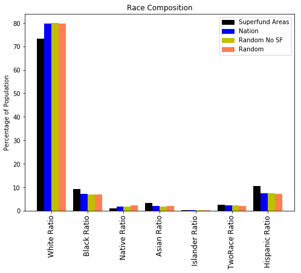


```python
plt.figure(figsize=(8,6))
whiteNonWhiteRatioLabels_v = ["White Ratio", "Non-White Ratio"]

getBarGraphSFAndNationComp(plt, whiteNonWhiteRatioLabels_v, sfcensus, censusByZipCd2015_df, no_sf_subset, random_subset, "White and Non-White Average Ratios", "Percentage of Population", "0", 111)
plt.show()
```


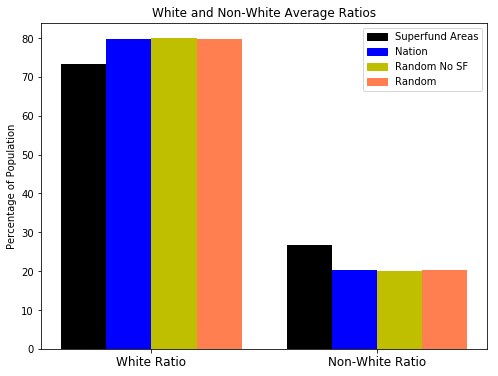


```python
plt.figure(figsize=(18,6))
plotMeanAndBellCurve(plt,"White Ratio", sfcensus, censusByZipCd2015_df, no_sf_subset, random_subset, "Distribution of Ratio Of White Population", "", "0", 121)
plotMeanAndBellCurve(plt,"Non-White Ratio", sfcensus, censusByZipCd2015_df, no_sf_subset, random_subset, "Distribution of Ratio Of Non-White Population", "", "0", 122)
plt.tight_layout(pad=1.5, w_pad=0.7, h_pad=0.5)
plt.show()    
```


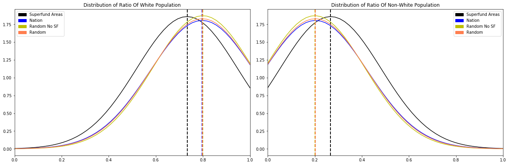


## Education


```python
print("SF Mean - Education: %s" % "{:,.0f}".format(sfcensus["Edu_Total"].mean()))
print("Nation Mean - Education: %s" % "{:,.0f}".format(censusByZipCd2015_df["Edu_Total"].mean()))
```

    SF Mean - Education: 9,149
    Nation Mean - Education: 4,324
    


```python
plt.figure(figsize=(8,6))
popRatioLabels_v = ["Edu_HSAndBelow_Ratio", "Edu_Undergrad_Ratio","Edu_Graduate_Ratio"]
getBarGraphSFAndNationComp(plt, popRatioLabels_v, sfcensus, censusByZipCd2015_df, no_sf_subset, random_subset, "Education Level Composition", "Percentage of Population", "0", 111)
plt.show()
```


```python
plt.figure(figsize=(8,6))
popRatioLabels_v = ["Edu_HSAndBelow_Ratio", "Edu_AboveHS_Ratio"]
getBarGraphSFAndNationComp(plt, popRatioLabels_v, sfcensus, censusByZipCd2015_df, no_sf_subset, random_subset, "Education Level Composition", "Percentage of Population", "0", 111)
plt.show()
```


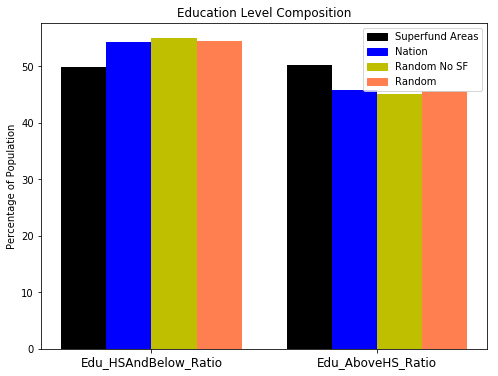


## Economic Variables


```python
print("SF Median income - significant")
stats.ttest_1samp(a=pd.Series(pd.to_numeric(sfcensus["B19013_001E"].dropna())), popmean=pd.to_numeric(censusByZipCd2015_df["B19013_001E"].dropna()).mean())
```

    SF Median income - significant
    


    Ttest_1sampResult(statistic=3.6402901585240923, pvalue=0.00028535203130582539)


```python
print("SF Median income")
print("SF Mean %s " % "${:,.0f}".format(pd.Series(pd.to_numeric(sfcensus["B19013_001E"].dropna())).mean()))
print("Nation Mean %s" % "${:,.0f}".format(pd.to_numeric(censusByZipCd2015_df["B19013_001E"].dropna()).mean()))
```

    SF Median income
    SF Mean $55,940 
    Nation Mean $53,434
    


```python
print("SF Median income")
print("SF Mean %s " % "${:,.0f}".format(pd.Series(pd.to_numeric(sfcensus["B19013_001E"].dropna())).mean()))
print("Nation Mean %s" % "${:,.0f}".format(pd.to_numeric(censusByZipCd2015_df["B19013_001E"].dropna()).mean()))

print("SF Income per capita - not signficant")
stats.ttest_1samp(a=pd.Series(pd.to_numeric(sfcensus["B19301_001E"].dropna())), popmean=pd.to_numeric(censusByZipCd2015_df["B19301_001E"].dropna()).mean())
```

    SF Median income
    SF Mean $55,940 
    Nation Mean $53,434
    SF Income per capita - not signficant
    


    Ttest_1sampResult(statistic=1.229730343971863, pvalue=0.21906468461352607)


```python
print("Income per capita")
print("SF Mean %s " % "${:,.0f}".format(pd.Series(pd.to_numeric(sfcensus["B19301_001E"].dropna())).mean()))
print("Nation Mean %s" % "${:,.0f}".format(pd.to_numeric(censusByZipCd2015_df["B19301_001E"].dropna()).mean()))
```

    Income per capita
    SF Mean $27,256 
    Nation Mean $26,867
    


```python
print("Random No SF Subset Median income - significant")
stats.ttest_1samp(a=pd.Series(pd.to_numeric(no_sf_subset["B19013_001E"].dropna())), popmean=pd.to_numeric(censusByZipCd2015_df["B19013_001E"].dropna()).mean())
```

    Random No SF Subset Median income - significant
    


    Ttest_1sampResult(statistic=-0.6575896366346351, pvalue=0.51093993358823553)


```python
print("Random Subset Median income - not significant")
stats.ttest_1samp(a=pd.Series(pd.to_numeric(random_subset["B19013_001E"].dropna())), popmean=pd.to_numeric(censusByZipCd2015_df["B19013_001E"].dropna()).mean())
```

    Random Subset Median income - not significant
    


    Ttest_1sampResult(statistic=-0.88129159114593492, pvalue=0.3783535902881876)


```python
print("Median income")
print("SF Mean %s " % "${:,.0f}".format(pd.Series(pd.to_numeric(sfcensus["B19013_001E"].dropna())).mean()))
print("Nation Mean %s" % "${:,.0f}".format(pd.to_numeric(censusByZipCd2015_df["B19013_001E"].dropna()).mean()))
print("Random No SF Subset Mean %s" % "${:,.0f}".format(pd.to_numeric(no_sf_subset["B19013_001E"].dropna()).mean()))
print("Random Subset Mean %s" % "${:,.0f}".format(pd.to_numeric(random_subset["B19013_001E"].dropna()).mean()))
```

    Median income
    SF Mean $55,940 
    Nation Mean $53,434
    Random No SF Subset Mean $52,992
    Random Subset Mean $52,851
    


```python
print("Random No SF Subset Income per capita - signficant")
stats.ttest_1samp(a=pd.Series(pd.to_numeric(no_sf_subset["B19301_001E"].dropna())), popmean=pd.to_numeric(censusByZipCd2015_df["B19301_001E"].dropna()).mean())
```

    Random No SF Subset Income per capita - signficant
    


    Ttest_1sampResult(statistic=-1.2458204035213243, pvalue=0.21308721087865876)


```python
print("Random Subset Income per capita - not signficant")
stats.ttest_1samp(a=pd.Series(pd.to_numeric(random_subset["B19301_001E"].dropna())), popmean=pd.to_numeric(censusByZipCd2015_df["B19301_001E"].dropna()).mean())
```

    Random Subset Income per capita - not signficant
    


    Ttest_1sampResult(statistic=-0.16886413999472674, pvalue=0.86593346213535338)


```python
print("Income per capita")
print("SF Mean %s " % "${:,.0f}".format(pd.Series(pd.to_numeric(sfcensus["B19301_001E"].dropna())).mean()))
print("Nation Mean %s" % "${:,.0f}".format(pd.to_numeric(censusByZipCd2015_df["B19301_001E"].dropna()).mean()))
print("Random No SF Mean %s " % "${:,.0f}".format(pd.Series(pd.to_numeric(no_sf_subset["B19301_001E"].dropna())).mean()))
print("Random Subset Mean %s" % "${:,.0f}".format(pd.to_numeric(random_subset["B19301_001E"].dropna()).mean()))
```

    Income per capita
    SF Mean $27,256 
    Nation Mean $26,867
    Random No SF Mean $26,436 
    Random Subset Mean $26,802
    


```python
plt.figure(figsize=(18,6))
getBarGraphSFAndNationInd(plt, ["B19013_001E"], sfcensus, censusByZipCd2015_df, no_sf_subset, random_subset, "Household Income", "Percentage of Population", "0", 121, 50000,60000,1)
getBarGraphSFAndNationInd(plt, ["B19301_001E"], sfcensus, censusByZipCd2015_df, no_sf_subset, random_subset, "Per Capita Income", "Percentage of Population", "0", 122, 25000,30000,1)
plt.show()
```


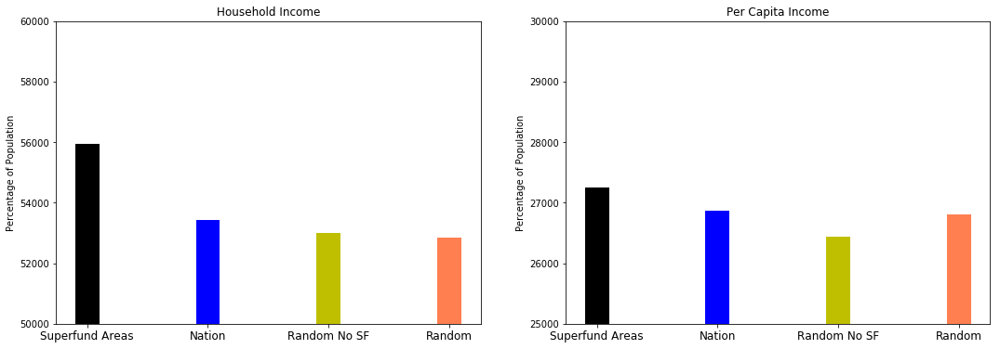


### Employment Status


```python
print("SF Labor Force - significant")
stats.ttest_1samp(a=pd.Series(pd.to_numeric(sfcensus["LaborForce_Ratio"].dropna())), popmean=pd.to_numeric(censusByZipCd2015_df["LaborForce_Total"].dropna()).mean())
```

    SF Labor Force - significant
    


    Ttest_1sampResult(statistic=-2585372.3483041916, pvalue=0.0)


```python
print("Random No SF Subset Labor Force - significant")
stats.ttest_1samp(a=pd.Series(pd.to_numeric(no_sf_subset["LaborForce_Ratio"].dropna())), popmean=pd.to_numeric(censusByZipCd2015_df["LaborForce_Total"].dropna()).mean())
```

    Random No SF Subset Labor Force - significant
    


    Ttest_1sampResult(statistic=-2149414.0920477319, pvalue=0.0)


```python
print("Random Subset Labor Force - significant")
stats.ttest_1samp(a=pd.Series(pd.to_numeric(random_subset["LaborForce_Ratio"].dropna())), popmean=pd.to_numeric(censusByZipCd2015_df["LaborForce_Total"].dropna()).mean())
```

    Random Subset Labor Force - significant
    


    Ttest_1sampResult(statistic=-2102039.606215944, pvalue=0.0)


```python
print("SF Labor Force Rate %f" % (sfcensus["LaborForce_Ratio"].mean()*100))
print("Nation Labor Force Rate %f" % (censusByZipCd2015_df["LaborForce_Ratio"].mean()*100))
print("Random No SF Subset SF Labor Force Rate %f" % (no_sf_subset["LaborForce_Ratio"].mean()*100))
print("Random Labor Force Rate %f" % (random_subset["LaborForce_Ratio"].mean()*100))
```

    SF Labor Force Rate 63.436950
    Nation Labor Force Rate 60.011797
    Random No SF Subset SF Labor Force Rate 59.987532
    Random Labor Force Rate 59.722508
    


```python
plt.figure(figsize=(8,6))
getBarGraphSFAndNationInd(plt, ["LaborForce_Ratio"], sfcensus, censusByZipCd2015_df, no_sf_subset, random_subset, "% in Labor Force", "Percentage of Population", "0", 111, 0,100, 100)
plt.show()
```


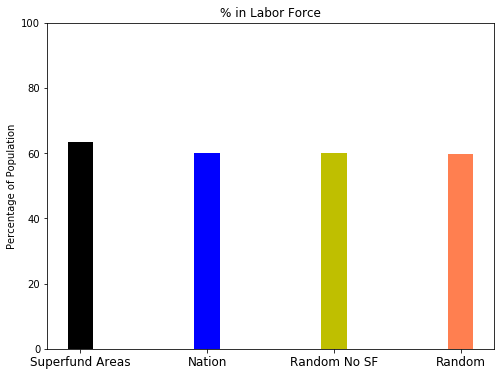


```python
print("SF Employed - significant")
stats.ttest_1samp(a=pd.Series(pd.to_numeric(sfcensus["Employment_Ratio"].dropna())), popmean=pd.to_numeric(censusByZipCd2015_df["Employment_Total"].dropna()).mean())
```

    SF Employed - significant
    


    Ttest_1sampResult(statistic=-3267314.2035306636, pvalue=0.0)


```python
print("Random No SF Subset Employed - significant")
stats.ttest_1samp(a=pd.Series(pd.to_numeric(no_sf_subset["Employment_Ratio"].dropna())), popmean=pd.to_numeric(censusByZipCd2015_df["Employment_Total"].dropna()).mean())
```

    Random No SF Subset Employed - significant
    


    Ttest_1sampResult(statistic=-2096498.8817460348, pvalue=0.0)


```python
print("Random Subset Employed - significant")
stats.ttest_1samp(a=pd.Series(pd.to_numeric(random_subset["Employment_Ratio"].dropna())), popmean=pd.to_numeric(censusByZipCd2015_df["Employment_Total"].dropna()).mean())
```

    Random Subset Employed - significant
    


    Ttest_1sampResult(statistic=-2379277.0102371559, pvalue=0.0)


```python
print("SF Employment Rate %f" % (sfcensus["Employment_Ratio"].mean()*100))
print("Nation Employment Rate %f" % (censusByZipCd2015_df["Employment_Ratio"].mean()*100))
print("Random No SF Subset SF Employment Rate %f" % (no_sf_subset["Employment_Ratio"].mean()*100))
print("Random Employment Rate %f" % (random_subset["Employment_Ratio"].mean()*100))
```

    SF Employment Rate 91.229091
    Nation Employment Rate 91.867127
    Random No SF Subset SF Employment Rate 91.571155
    Random Employment Rate 91.761579
    


```python
plt.figure(figsize=(8,6))
getBarGraphSFAndNationInd(plt, ["Employment_Ratio"], sfcensus, censusByZipCd2015_df, no_sf_subset, random_subset, "% Employed", "Percentage of Population", "0", 111, 0,100, 100)
plt.show()
```


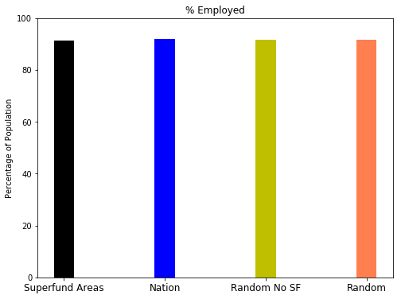


## Housing


```python
print("SF Median home value - significant")
stats.ttest_1samp(a=pd.Series(pd.to_numeric(sfcensus["B25077_001E"].dropna())), popmean=pd.to_numeric(censusByZipCd2015_df["B25077_001E"].dropna()).mean())
```

    SF Median home value - significant
    


    Ttest_1sampResult(statistic=5.2383258399985149, pvalue=1.9608628676500721e-07)


```python
print("Random No SF Subset Median home value - significant")
stats.ttest_1samp(a=pd.Series(pd.to_numeric(no_sf_subset["B25077_001E"].dropna())), popmean=pd.to_numeric(censusByZipCd2015_df["B25077_001E"].dropna()).mean())
```

    Random No SF Subset Median home value - significant
    


    Ttest_1sampResult(statistic=-1.6892461877426068, pvalue=0.09146277926754981)


```python
print("Random Subset Median home value - not significant")
stats.ttest_1samp(a=pd.Series(pd.to_numeric(random_subset["B25077_001E"].dropna())), popmean=pd.to_numeric(censusByZipCd2015_df["B25077_001E"].dropna()).mean())
```

    Random Subset Median home value - not significant
    


    Ttest_1sampResult(statistic=0.17423184333419561, pvalue=0.86171609667357152)


```python
print("Median home value")
print("SF Mean %s " % "${:,.0f}".format(pd.Series(pd.to_numeric(sfcensus["B25077_001E"].dropna())).mean()))
print("Nation Mean %s" % "${:,.0f}".format(pd.to_numeric(censusByZipCd2015_df["B25077_001E"].dropna()).mean()))
print("Random No SF Subset Mean %s " % "${:,.0f}".format(pd.Series(pd.to_numeric(no_sf_subset["B25077_001E"].dropna())).mean()))
print("Random Subset Mean %s" % "${:,.0f}".format(pd.to_numeric(random_subset["B25077_001E"].dropna()).mean()))
```

    Median home value
    SF Mean $198,718 
    Nation Mean $174,909
    Random No SF Subset Mean $168,123 
    Random Subset Mean $175,780
    


```python
plt.figure(figsize=(8,6))
getBarGraphSFAndNationInd(plt, ["B25077_001E"], sfcensus, censusByZipCd2015_df, no_sf_subset, random_subset, "Median Home Value", "Dollars", "0", 111, 150000,200000, 1)
plt.show()
```


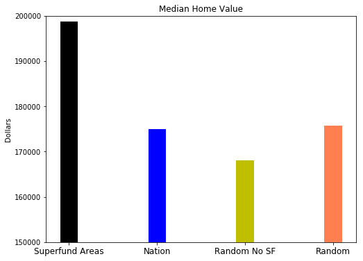


```python
print("SF Owning percentage of income towards housing - Significant")
stats.ttest_1samp(a=pd.Series(pd.to_numeric(sfcensus["incomeOwning"].dropna())), popmean=pd.to_numeric(censusByZipCd2015_df["incomeOwning"].dropna()).mean())
```

    SF Owning percentage of income towards housing - Significant
    


    Ttest_1sampResult(statistic=7.5333281989455694, pvalue=1.0830041191670336e-13)


```python
print("Random No SF Subset SF Owning percentage of income towards housing - WILDLY significant")
stats.ttest_1samp(a=pd.Series(pd.to_numeric(no_sf_subset["incomeOwning"].dropna())), popmean=pd.to_numeric(censusByZipCd2015_df["incomeRenting"].dropna()).mean())
```

    Random No SF Subset SF Owning percentage of income towards housing - WILDLY significant
    


    Ttest_1sampResult(statistic=37.029886502923645, pvalue=1.8455571124836755e-191)


```python
print("Random Subset SF Owning percentage of income towards housing - WILDLY significant")
stats.ttest_1samp(a=pd.Series(pd.to_numeric(random_subset["incomeOwning"].dropna())), popmean=pd.to_numeric(censusByZipCd2015_df["incomeRenting"].dropna()).mean())
```

    Random Subset SF Owning percentage of income towards housing - WILDLY significant
    


    Ttest_1sampResult(statistic=37.814935074336816, pvalue=2.0004464015307022e-196)


```python
plt.figure(figsize=(12,6))
plotMeanAndBellCurve(plt,"incomeOwning", sfcensus, censusByZipCd2015_df, no_sf_subset, random_subset, "Percentage of Income Toward Housing - Ownership", "", "0", 121)
plt.tight_layout(pad=1.5, w_pad=0.7, h_pad=0.5)
plt.show()  
```


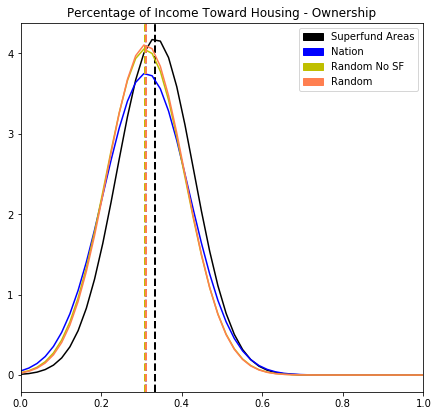


```python
print("SF Renting percentage of income towards housing")
stats.ttest_1samp(a=pd.Series(pd.to_numeric(sfcensus["incomeRenting"].dropna())), popmean=pd.to_numeric(censusByZipCd2015_df["incomeRenting"].dropna()).mean())
```

    SF Renting percentage of income towards housing
    


    Ttest_1sampResult(statistic=6.7144896985868208, pvalue=3.0847563604919364e-11)


```python
print("Random No SF Subset SF Renting percentage of income towards housing - not significant")
stats.ttest_1samp(a=pd.Series(pd.to_numeric(no_sf_subset["incomeRenting"].dropna())), popmean=pd.to_numeric(censusByZipCd2015_df["incomeRenting"].dropna()).mean())
```

    Random No SF Subset SF Renting percentage of income towards housing - not significant
    


    Ttest_1sampResult(statistic=-0.52672927023468452, pvalue=0.59850328653028617)


```python
print("Random Subset SF Renting percentage of income towards housing - not significant")
stats.ttest_1samp(a=pd.Series(pd.to_numeric(random_subset["incomeRenting"].dropna())), popmean=pd.to_numeric(censusByZipCd2015_df["incomeRenting"].dropna()).mean())
```

    Random Subset SF Renting percentage of income towards housing - not significant
    


    Ttest_1sampResult(statistic=0.31768208327280123, pvalue=0.75079461702977823)


```python
plt.figure(figsize=(12,6))
plotMeanAndBellCurve(plt,"incomeRenting", sfcensus, censusByZipCd2015_df, no_sf_subset, random_subset, "Percentage of Income Toward Housing - Renting", "", "0", 121)
plt.tight_layout(pad=1.5, w_pad=0.7, h_pad=0.5)
plt.show()  
```


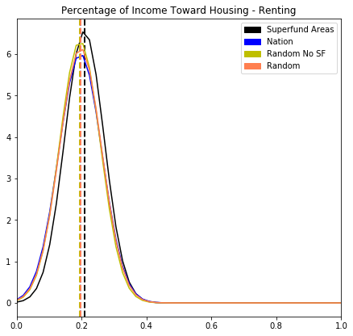


```python
print("Percentage of income towards housing - owning")
print("SF Mean %s " % "{:,.2f}%".format(pd.Series(pd.to_numeric(sfcensus["incomeOwning"].dropna())).mean()*100))
print("Nation Mean %s" % "{:,.2f}%".format(pd.to_numeric(censusByZipCd2015_df["incomeOwning"].dropna()).mean()*100))
print("Random No SF Subset Mean %s " % "{:,.2f}%".format(pd.Series(pd.to_numeric(no_sf_subset["incomeOwning"].dropna())).mean()*100))
print("Random Subset Mean %s" % "{:,.2f}%".format(pd.to_numeric(random_subset["incomeOwning"].dropna()).mean()*100))

print("Percentage of income towards housing - renting")
print("SF Mean %s " % "{:,.2f}%".format(pd.Series(pd.to_numeric(sfcensus["incomeRenting"].dropna())).mean()*100))
print("Nation Mean %s" % "{:,.2f}%".format(pd.to_numeric(censusByZipCd2015_df["incomeRenting"].dropna()).mean()*100))
```

    Percentage of income towards housing - owning
    SF Mean 33.47% 
    Nation Mean 31.23%
    Random No SF Subset Mean 30.98% 
    Random Subset Mean 31.11%
    Percentage of income towards housing - renting
    SF Mean 20.89% 
    Nation Mean 19.63%
    


```python
plt.figure(figsize=(18,6))
getBarGraphSFAndNationInd(plt, ["incomeOwning"], sfcensus, censusByZipCd2015_df, no_sf_subset, random_subset, "incomeOwning", "Percentage of Population", "0", 121, 0,35,100)
getBarGraphSFAndNationInd(plt, ["incomeRenting"], sfcensus, censusByZipCd2015_df, no_sf_subset, random_subset, "incomeRenting", "Percentage of Population", "0", 122, 0,25,100)
plt.show()
```


```python
plt.figure(figsize=(8,6))
getBarGraphSFAndNationInd(plt, ["incomeOwning"], sfcensus, censusByZipCd2015_df, no_sf_subset, random_subset, "incomeOwning", "Percentage of Population", "0", 111, 0,35,100)
plt.show()
```


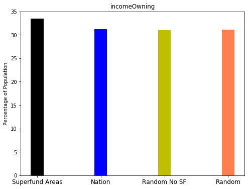


```python
plt.figure(figsize=(8,6))
getBarGraphSFAndNationInd(plt, ["incomeRenting"], sfcensus, censusByZipCd2015_df, no_sf_subset, random_subset, "incomeRenting", "Percentage of Population", "0", 111, 0,25,100)
plt.show()
```


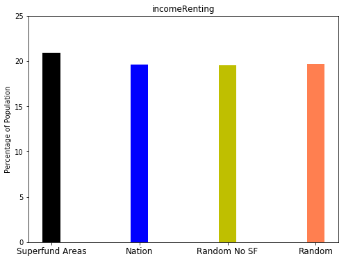


## Occupation


```python
occupationLabels = ["Mgmt_Business_Science_Arts", \
                    "Mgmt_Business_Financial", \
                    "Management", \
                    "business_and_financial_operations_occupations_ratio", \
                    "Computer_Engineering_and_Science", \
                    "computer_and_mathematical_occupations_ratio", \
                    "architecture_and_engineering_occupations_ratio", \
                    "life_physical_and_social_science_occupations_ratio", \
                    "education_legal_community_service_arts_and_media_occupations_ratio", \
                    "community_and_social_service_occupations_ratio", \
                    "legal_occupations_ratio", \
                    "education_training_and_library_occupations_ratio", \
                    "arts_design_entertainment_sports_and_media_occupations_ratio", \
                    "healthcare_practitioners_and_technical_occupations_ratio", \
                    "health_diagnosing_and_treating_practitioners_and_other_technical_occupations_ratio", \
                    "health_technologists_and_technicians_ratio", \
                    "Service", \
                    "healthcare_support_occupations_ratio", \
                    "protective_service_occupations_ratio", \
                    "fire_fighting_and_prevention_and_other_protective_service_workers_including_supervisors_ratio", \
                    "law_enforcement_workers_including_supervisors_ratio", \
                    "food_preparation_and_serving_related_occupations_ratio", \
                    "building_and_grounds_cleaning_and_maintenance_occupations_ratio", \
                    "personal_care_and_service_occupations_ratio", \
                    "Sales_and_Office", \
                    "Office_and_Admin_Support", \
                    "Natural_Resources", \
                    "Farming_Fishing_Forestry", \
                    "construction_and_extraction_occupations_ratio", \
                    "installation_maintenance_and_repair_occupations_ratio", \
                    "production_transportation_and_material_moving_occupations_ratio", \
                    "production_occupations_ratio", \
                    "transportation_occupations_ratio", \
                    "material_moving_occupations_ratio"
                   ]
plt.figure(figsize=(18,12))
getBarGraphSFAndNationComp(plt, occupationLabels, sfcensus, censusByZipCd2015_df, no_sf_subset, random_subset, "Occupation Composition", "Percentage of Population", "90", 111)
plt.show()
```


```python
occupationLabels = ["Mgmt_Business_Financial", \
                   "Management", \
                    "Natural_Resources", \
                    "Farming_Fishing_Forestry"
                   ]
plt.figure(figsize=(8,6))
getBarGraphSFAndNationComp(plt, occupationLabels, sfcensus, censusByZipCd2015_df, no_sf_subset, random_subset, "Select Occupation Composition", "Percentage of Population", "0", 111)
plt.show()
```


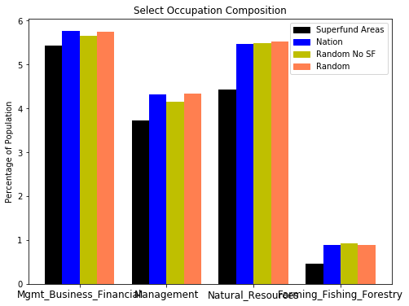


```python
occupationLabels = ["Service", \
                   "Computer_Engineering_and_Science", \
                    "Sales_and_Office", \
                    "Office_and_Admin_Support"
                   ]
plt.figure(figsize=(8,6))
getBarGraphSFAndNationComp(plt, occupationLabels, sfcensus, censusByZipCd2015_df, no_sf_subset, random_subset, "Select Occupation Composition", "Percentage of Population", "0", 111)
plt.show()
```


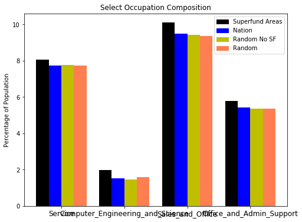


## Plot Superfund site counts per state


```python
yearRange = [1983, 1987, 1992, 1997, 2002, 2007, 2012, 2017]
rangeLabel = []
for index, x in enumerate(yearRange):
    if index == 0:
        rangeLabel.append(str(x) + " - " + str(x+3))
    elif index != len(yearRange)-1:
        rangeLabel.append(str(x) + " - " + str(x+4)) 
rangeLabel
sf["YearRange"] = pd.cut(sf["Year"], yearRange, labels=rangeLabel, include_lowest=True, right=False)
sf[sf["YearRange"]=="2012 - 2016"].sort_values("Year")
stateYear = pd.crosstab(sf['St'], sf['YearRange'])

stateYear.plot(kind="bar", stacked=True, figsize=(16,10))
plt.legend(bbox_to_anchor=(1,1),
           ncol=1, shadow=True, title="Legend", fancybox=False)
plt.title("NJ, CA, PA Hold Highest Number of Superfund sites")
plt.ylabel("Number of Superfund Sites")
plt.xlabel("US States and Territories")
plt.show()
```


## Find Superfund sites per State


```python
## Extract statewise superfund site count, add state names against abbreviations & area of states in sq. miles 
sitesPerState = sf.groupby('St').count()
sitesPerState = sitesPerState.reset_index()
sitesPerState = sitesPerState[['St','Reg']]
sitesPerState = sitesPerState.rename(columns= {'St':'Code','Reg':'No. Of SF Sites'})
for state in states:
    if state not in sitesPerState['Code'].tolist():
        nxtIdx = len(sitesPerState)
        sitesPerState.set_value(nxtIdx, 'Code', state)
        sitesPerState.set_value(nxtIdx, 'No. Of SF Sites', 0)

sitesPerState['Name'] = sitesPerState['Code'].map(states.get)
sitesPerState['Area Sq Miles'] = sitesPerState['Name'].map(statesAreaInMiles.get)
sitesPerState['No. Of Sites Per Sq Miles'] = sitesPerState['No. Of SF Sites'].astype('float') / sitesPerState['Area Sq Miles'].astype('float')
sitesPerState.dropna(inplace=True)
sitesPerState.head()
```


<div>
<style>
    .dataframe thead tr:only-child th {
        text-align: right;
    }

    .dataframe thead th {
        text-align: left;
    }

    .dataframe tbody tr th {
        vertical-align: top;
    }
</style>
<table border="1" class="dataframe">
  <thead>
    <tr style="text-align: right;">
      <th></th>
      <th>Code</th>
      <th>No. Of SF Sites</th>
      <th>Name</th>
      <th>Area Sq Miles</th>
      <th>No. Of Sites Per Sq Miles</th>
    </tr>
  </thead>
  <tbody>
    <tr>
      <th>0</th>
      <td>AK</td>
      <td>6.0</td>
      <td>Alaska</td>
      <td>571951.26</td>
      <td>0.000010</td>
    </tr>
    <tr>
      <th>1</th>
      <td>AL</td>
      <td>12.0</td>
      <td>Alabama</td>
      <td>50744.00</td>
      <td>0.000236</td>
    </tr>
    <tr>
      <th>2</th>
      <td>AR</td>
      <td>9.0</td>
      <td>Arkansas</td>
      <td>52068.17</td>
      <td>0.000173</td>
    </tr>
    <tr>
      <th>3</th>
      <td>AZ</td>
      <td>9.0</td>
      <td>Arizona</td>
      <td>113634.57</td>
      <td>0.000079</td>
    </tr>
    <tr>
      <th>4</th>
      <td>CA</td>
      <td>98.0</td>
      <td>California</td>
      <td>155959.34</td>
      <td>0.000628</td>
    </tr>
  </tbody>
</table>
</div>


## Extract Census data for 2015 for all US States


```python
c = Census(censuskey, year=2015)
censusByStates2015 = c.acs5.get(("NAME", "B19013_001E", "B01003_001E", "B19301_001E", "B25077_001E"), {'for': 'state:*'})
censusByStates2015_df = pd.DataFrame(censusByStates2015)
censusByStates2015_df = censusByStates2015_df.rename(columns={"B01003_001E": "Population", 
                                                              "B19013_001E": "Household Income",
                                                              "B19301_001E": "Per Capita Income",
                                                              "B25077_001E": "Median House Price",
                                                              "NAME": "Name", "state": "State"})
censusByStates2015_df.head()
```


<div>
<style>
    .dataframe thead tr:only-child th {
        text-align: right;
    }

    .dataframe thead th {
        text-align: left;
    }

    .dataframe tbody tr th {
        vertical-align: top;
    }
</style>
<table border="1" class="dataframe">
  <thead>
    <tr style="text-align: right;">
      <th></th>
      <th>Population</th>
      <th>Household Income</th>
      <th>Per Capita Income</th>
      <th>Median House Price</th>
      <th>Name</th>
      <th>State</th>
    </tr>
  </thead>
  <tbody>
    <tr>
      <th>0</th>
      <td>733375</td>
      <td>72515</td>
      <td>33413</td>
      <td>250000</td>
      <td>Alaska</td>
      <td>02</td>
    </tr>
    <tr>
      <th>1</th>
      <td>4830620</td>
      <td>43623</td>
      <td>24091</td>
      <td>125500</td>
      <td>Alabama</td>
      <td>01</td>
    </tr>
    <tr>
      <th>2</th>
      <td>2958208</td>
      <td>41371</td>
      <td>22798</td>
      <td>111400</td>
      <td>Arkansas</td>
      <td>05</td>
    </tr>
    <tr>
      <th>3</th>
      <td>6641928</td>
      <td>50255</td>
      <td>25848</td>
      <td>167500</td>
      <td>Arizona</td>
      <td>04</td>
    </tr>
    <tr>
      <th>4</th>
      <td>38421464</td>
      <td>61818</td>
      <td>30318</td>
      <td>385500</td>
      <td>California</td>
      <td>06</td>
    </tr>
  </tbody>
</table>
</div>


## Merge Census data for States with Superfund sites data per State


```python
censusStateAndSFSites = pd.merge(censusByStates2015_df,sitesPerState,on='Name')
censusStateAndSFSites['Population Density'] = censusStateAndSFSites['Population'].astype('int') / censusStateAndSFSites['Area Sq Miles'].astype('float')
censusStateAndSFSites.head()
```


<div>
<style>
    .dataframe thead tr:only-child th {
        text-align: right;
    }

    .dataframe thead th {
        text-align: left;
    }

    .dataframe tbody tr th {
        vertical-align: top;
    }
</style>
<table border="1" class="dataframe">
  <thead>
    <tr style="text-align: right;">
      <th></th>
      <th>Population</th>
      <th>Household Income</th>
      <th>Per Capita Income</th>
      <th>Median House Price</th>
      <th>Name</th>
      <th>State</th>
      <th>Code</th>
      <th>No. Of SF Sites</th>
      <th>Area Sq Miles</th>
      <th>No. Of Sites Per Sq Miles</th>
      <th>Population Density</th>
    </tr>
  </thead>
  <tbody>
    <tr>
      <th>0</th>
      <td>733375</td>
      <td>72515</td>
      <td>33413</td>
      <td>250000</td>
      <td>Alaska</td>
      <td>02</td>
      <td>AK</td>
      <td>6.0</td>
      <td>571951.26</td>
      <td>0.000010</td>
      <td>1.282233</td>
    </tr>
    <tr>
      <th>1</th>
      <td>4830620</td>
      <td>43623</td>
      <td>24091</td>
      <td>125500</td>
      <td>Alabama</td>
      <td>01</td>
      <td>AL</td>
      <td>12.0</td>
      <td>50744.00</td>
      <td>0.000236</td>
      <td>95.195885</td>
    </tr>
    <tr>
      <th>2</th>
      <td>2958208</td>
      <td>41371</td>
      <td>22798</td>
      <td>111400</td>
      <td>Arkansas</td>
      <td>05</td>
      <td>AR</td>
      <td>9.0</td>
      <td>52068.17</td>
      <td>0.000173</td>
      <td>56.814134</td>
    </tr>
    <tr>
      <th>3</th>
      <td>6641928</td>
      <td>50255</td>
      <td>25848</td>
      <td>167500</td>
      <td>Arizona</td>
      <td>04</td>
      <td>AZ</td>
      <td>9.0</td>
      <td>113634.57</td>
      <td>0.000079</td>
      <td>58.449889</td>
    </tr>
    <tr>
      <th>4</th>
      <td>38421464</td>
      <td>61818</td>
      <td>30318</td>
      <td>385500</td>
      <td>California</td>
      <td>06</td>
      <td>CA</td>
      <td>98.0</td>
      <td>155959.34</td>
      <td>0.000628</td>
      <td>246.355646</td>
    </tr>
  </tbody>
</table>
</div>


## Plot Statewise Superfund Sites density and Population density


```python
plt.figure(figsize=(18,12))
plt = plotUSmapBasemap(plt, 221, "Population Density", 'State Population Density (Per Sq Mile)', \
                      censusStateAndSFSites["Population Density"].min()/censusStateAndSFSites["Population Density"].sum(), \
                      censusStateAndSFSites["Population Density"].max()/censusStateAndSFSites["Population Density"].sum(), 7, \
                      plt.cm.Blues_r)
plt = plotUSmapBasemap(plt, 222, "No. Of Sites Per Sq Miles", 'State Superfund Site Density (Per Sq Mile)', \
                      0.000001, censusStateAndSFSites["No. Of Sites Per Sq Miles"].max()/censusStateAndSFSites["No. Of Sites Per Sq Miles"].sum(), 3, \
                      plt.cm.Blues_r)
plt = plotUSmapBasemap(plt, 223, "Household Income", 'State Household Income', \
                      censusStateAndSFSites["Household Income"].astype('float').min()/censusStateAndSFSites["Household Income"].astype('float').sum(), \
                      censusStateAndSFSites["Household Income"].astype('float').max()/censusStateAndSFSites["Household Income"].astype('float').sum(), 0.5, \
                      plt.cm.Oranges_r)
plt = plotUSmapBasemap(plt, 224, "Median House Price", 'State Median House Price', \
                      censusStateAndSFSites["Median House Price"].astype('float').min()/censusStateAndSFSites["Median House Price"].astype('float').sum(), \
                      censusStateAndSFSites["Median House Price"].astype('float').max()/censusStateAndSFSites["Median House Price"].astype('float').sum(), 1, \
                      plt.cm.Oranges_r)
plt.tight_layout()
plt.show()
```


## Plot Superfund Site counts and Census data on US Map


```python
censusStateAndSFSitesStr = censusStateAndSFSites.copy()
for col in censusStateAndSFSitesStr.columns:
    censusStateAndSFSitesStr[col] = censusStateAndSFSitesStr[col].astype(str)

scl = [[0.0, 'rgb(242,240,247)'],[0.2, 'rgb(218,218,235)'],[0.4, 'rgb(188,189,220)'],\
            [0.6, 'rgb(158,154,200)'],[0.8, 'rgb(117,107,177)'],[1.0, 'rgb(84,39,143)']]

censusStateAndSFSitesStr['text'] = censusStateAndSFSitesStr['Name'] + '<br>' +\
    'No. Of Sites/Sq Mile: '+censusStateAndSFSitesStr['No. Of Sites Per Sq Miles']+ '<br>' +\
    'Population/Sq Mile: '+censusStateAndSFSitesStr['Population Density']+ '<br>' +\
    'Household Income: '+censusStateAndSFSitesStr['Household Income'] + '<br>' +\
    'Per Capita Income: '+censusStateAndSFSitesStr['Per Capita Income'] + '<br>' +\
    'Median House Price: '+censusStateAndSFSitesStr['Median House Price']

data = [ dict(
        type='choropleth',
        colorscale = scl,
        autocolorscale = False,
        locations = censusStateAndSFSitesStr['Code'],
        z = censusStateAndSFSitesStr['No. Of SF Sites'].astype(float),
        locationmode = 'USA-states',
        text = censusStateAndSFSitesStr['text'],
        marker = dict(
            line = dict (
                color = 'rgb(255,255,255)',
                width = 2
            ) ),
        colorbar = dict(
            title = "No Of Sites")
        ) ]

layout = dict(
        title = 'Number of Superfund sites as of 2016<br> [Hover for breakdown]',
        geo = dict(
            scope='usa',
            projection=dict( type='albers usa' ),
            showlakes = True,
            lakecolor = 'rgb(255, 255, 255)'),
             )
    
fig = dict( data=data, layout=layout )
py.offline.iplot( fig, filename='d3-cloropleth-map' )

```


```python
sfFilterLatLon = sf.copy()
sfFilterLatLon.drop(sfFilterLatLon.index[[756,1104]], inplace=True)
sfFilterLatLon.dropna(subset=[['Latitude','Longitude']],inplace=True)
sfFilterLatLon.reset_index(inplace=True)
latitudes = pd.to_numeric(sfFilterLatLon['Latitude']).tolist()
longitudes = pd.to_numeric(sfFilterLatLon['Longitude']).tolist()
sfFilterLatLon['Site Name'] = sfFilterLatLon['Site Name                                                                ']
sitename = sfFilterLatLon['Site Name'].tolist()
```


```python
#Function to add Google api key in html code for generated by gmplot
def insertapikey(fname, apikey):
    """put the google api key in a html file"""
    def putkey(htmltxt, apikey, apistring=None):
        """put the apikey in the htmltxt and return soup"""
        if not apistring:
            apistring = "https://maps.googleapis.com/maps/api/js?key=%s&callback=initMap"
        soup = BeautifulSoup(htmltxt, 'html.parser')
        body = soup.body
        src = apistring % (apikey, )
        tscript = soup.new_tag("script", src=src, async="defer")
        body.insert(-1, tscript)
        return soup
    htmltxt = open(fname, 'r').read()
    soup = putkey(htmltxt, apikey)
    newtxt = soup.prettify()
    open(fname, 'w').write(newtxt)
```

## Plot all Superfund sites on Google map 


```python
fname = "allSFSites.html"
gmap = gmplot.GoogleMapPlotter(37.428, -95.145, 4)
for x in range(len(longitudes)):
    gmap.circle(latitudes[x],longitudes[x], 3000, "r", ew=1)
gmap.draw(fname)  

insertapikey(fname, gkey)
display(IFrame(fname, width=800, height=400))
```


        


## Plot markers for all Superfund sites near a specific location

### (300 Atrium Drive, Somerset, NJ)


```python
cur_addr = "300 atrium drive somerset nj"
target_url = "https://maps.googleapis.com/maps/api/geocode/json" \
    "?address=%s&key=%s" % (cur_addr, gkey)
geo_data = requests.get(target_url).json()
lat = geo_data["results"][0]["geometry"]["location"]["lat"]
lon = geo_data["results"][0]["geometry"]["location"]["lng"]
```


```python
fname = "nearbySFSites.html"
gmap = gmplot.GoogleMapPlotter(lat, lon, 12)
for x in range(len(longitudes)):
    gmap.marker(latitudes[x],longitudes[x], title=sitename[x])
gmap.marker(lat,lon,'g',title=cur_addr)
gmap.coloricon = "http://www.googlemapsmarkers.com/v1/%s/"
gmap.draw(fname) 

insertapikey(fname, gkey)
display(IFrame(fname, width=800, height=400))
```


       


## Extract Census data of 2011 to 2015 for all US zip codes


```python
census_df_all = pd.DataFrame([])
yrs = [2011,2012,2013,2014,2015]
for x in yrs:
    c = Census(censuskey, year=x)
    census_df_tmp = pd.DataFrame([])
    census_df_tmp['Year'] = ""
    # removed following as not available for all years - B23025_002E, B23025_007E, B23025_003E, B23025_004E, B23025_005E, B23025_006E, B15003_002E, B15003_017E, B15003_018E, B15003_021E, B15003_022E, B15003_023E, B15003_024E, B15003_025E
    census_data = c.acs5.get(("NAME", "B19013_001E", "B19301_001E", "C24010_003E", "C24010_004E", "C24010_005E", "C24010_006E", "C24010_007E", "C24010_008E", "C24010_009E", "C24010_010E", "C24010_011E", "C24010_012E", "C24010_013E", "C24010_014E", "C24010_015E", "C24010_016E", "C24010_017E", "C24010_018E", "C24010_019E", "C24010_020E", "C24010_021E", "C24010_022E", "C24010_023E", "C24010_024E", "C24010_025E", "C24010_026E", "C24010_027E", "C24010_028E", "C24010_029E", "C24010_030E", "C24010_031E", "C24010_032E", "C24010_033E", "C24010_034E", "C24010_035E", "C24010_036E", "C24010_037E", "C24010_039E", "C24010_040E", "C24010_041E", "C24010_042E", "C24010_043E", "C24010_044E", "C24010_045E", "C24010_046E", "C24010_047E", "C24010_048E", "C24010_049E", "C24010_050E", "C24010_051E", "C24010_052E", "C24010_053E", "C24010_054E", "C24010_055E", "C24010_056E", "C24010_057E", "C24010_058E", "C24010_059E", "C24010_060E", "C24010_061E", "C24010_062E", "C24010_063E", "C24010_064E", "C24010_065E", "C24010_066E", "C24010_067E", "C24010_068E", "C24010_069E", "C24010_070E", "C24010_071E", "C24010_072E", "C24010_073E", "B17001_002E", "B17001_003E", "B17001_017E", "B17001A_002E", "B17001B_002E", "B17001C_002E", "B17001D_002E", "B17001E_002E", "B17001G_002E", "B17001I_002E", "B17012_002E", "B17012_003E", "B17012_009E", "B17012_014E", "B01002_001E", "B01002_002E", "B01002_003E", "B01003_001E", "B02001_002E", "B02001_003E", "B02001_004E", "B02001_005E", "B02001_006E", "B02001_008E", "B03001_003E", "B25035_001E", "B25058_001E", "B25064_001E", "B25077_001E", "B25088_002E", "B08136_003E", "B08136_004E", "B08136_007E", "B08136_011E", "B08136_012E", "B08301_001E", "B08301_003E", "B08301_004E", "B08301_010E", "B08301_019E", "B08101_041E", "B16001_002E", "B16001_003E", "B16001_006E", "B16001_009E", "B16001_012E", "B16001_015E", "B16001_018E", "B16001_021E", "B16001_030E", "B16001_033E", "B16001_036E", "B16001_039E", "B16001_045E", "B16001_048E", "B16001_051E", "B16001_054E", "B16001_057E", "B16001_066E", "B16001_069E", "B16001_072E", "B16001_075E", "B16001_078E", "B16001_081E", "B16001_084E", "B16001_087E", "B16001_093E", "B16001_099E", "B16001_105E", "B16001_108E", "B16001_111E"), {'for': 'zip code tabulation area:*'})
    census_df_tmp = pd.DataFrame(census_data)
    census_df_tmp['Year'] = x
    census_df_all = census_df_all.append(census_df_tmp)
census_df_all.head()
```


<div>
<style>
    .dataframe thead tr:only-child th {
        text-align: right;
    }

    .dataframe thead th {
        text-align: left;
    }

    .dataframe tbody tr th {
        vertical-align: top;
    }
</style>
<table border="1" class="dataframe">
  <thead>
    <tr style="text-align: right;">
      <th></th>
      <th>B01002_001E</th>
      <th>B01002_002E</th>
      <th>B01002_003E</th>
      <th>B01003_001E</th>
      <th>B02001_002E</th>
      <th>B02001_003E</th>
      <th>B02001_004E</th>
      <th>B02001_005E</th>
      <th>B02001_006E</th>
      <th>B02001_008E</th>
      <th>...</th>
      <th>C24010_067E</th>
      <th>C24010_068E</th>
      <th>C24010_069E</th>
      <th>C24010_070E</th>
      <th>C24010_071E</th>
      <th>C24010_072E</th>
      <th>C24010_073E</th>
      <th>NAME</th>
      <th>zip code tabulation area</th>
      <th>Year</th>
    </tr>
  </thead>
  <tbody>
    <tr>
      <th>0</th>
      <td>44.1</td>
      <td>42.7</td>
      <td>45.6</td>
      <td>16775</td>
      <td>15996</td>
      <td>259</td>
      <td>17</td>
      <td>98</td>
      <td>0</td>
      <td>144</td>
      <td>...</td>
      <td>0</td>
      <td>0</td>
      <td>0</td>
      <td>187</td>
      <td>125</td>
      <td>62</td>
      <td>0</td>
      <td>ZCTA5 01001</td>
      <td>01001</td>
      <td>2011</td>
    </tr>
    <tr>
      <th>1</th>
      <td>23.8</td>
      <td>23.3</td>
      <td>24.5</td>
      <td>27684</td>
      <td>21922</td>
      <td>1190</td>
      <td>99</td>
      <td>3317</td>
      <td>0</td>
      <td>845</td>
      <td>...</td>
      <td>19</td>
      <td>57</td>
      <td>46</td>
      <td>152</td>
      <td>88</td>
      <td>44</td>
      <td>20</td>
      <td>ZCTA5 01002</td>
      <td>01002</td>
      <td>2011</td>
    </tr>
    <tr>
      <th>2</th>
      <td>19.9</td>
      <td>20</td>
      <td>19.9</td>
      <td>11516</td>
      <td>9574</td>
      <td>636</td>
      <td>0</td>
      <td>945</td>
      <td>3</td>
      <td>265</td>
      <td>...</td>
      <td>0</td>
      <td>6</td>
      <td>29</td>
      <td>366</td>
      <td>300</td>
      <td>22</td>
      <td>44</td>
      <td>ZCTA5 01003</td>
      <td>01003</td>
      <td>2011</td>
    </tr>
    <tr>
      <th>3</th>
      <td>42.8</td>
      <td>42.6</td>
      <td>43.3</td>
      <td>5045</td>
      <td>4953</td>
      <td>6</td>
      <td>9</td>
      <td>63</td>
      <td>0</td>
      <td>0</td>
      <td>...</td>
      <td>0</td>
      <td>0</td>
      <td>0</td>
      <td>100</td>
      <td>64</td>
      <td>0</td>
      <td>36</td>
      <td>ZCTA5 01005</td>
      <td>01005</td>
      <td>2011</td>
    </tr>
    <tr>
      <th>4</th>
      <td>40.5</td>
      <td>38.1</td>
      <td>42.1</td>
      <td>14479</td>
      <td>13619</td>
      <td>188</td>
      <td>0</td>
      <td>185</td>
      <td>0</td>
      <td>280</td>
      <td>...</td>
      <td>15</td>
      <td>9</td>
      <td>45</td>
      <td>111</td>
      <td>54</td>
      <td>45</td>
      <td>12</td>
      <td>ZCTA5 01007</td>
      <td>01007</td>
      <td>2011</td>
    </tr>
  </tbody>
</table>
<p>5 rows × 146 columns</p>
</div>


```python
zips, population, house_value, age, capita, income, poverty, year = [[] * 8 for x in range(8)]
for index, row in sf.iterrows():
    if row["Converted Date"].year == int("2009"):
        zips.append(row["Zip"])
for index, row in census_df_all.iterrows():
    for code in zips:
        if (code == row["zip code tabulation area"]):
            population.append(row['B01003_001E'])
            house_value.append(row['B25077_001E'])
            age.append(row['B01002_001E'])
            capita.append(row['B19301_001E'])
            income.append(row['B19013_001E'])
            poverty.append(row['B17001_002E'])
            year.append(row["Year"])

sf_census = pd.DataFrame({
    "Population":population,
    "House Value":house_value,
    "Age":age,
    "Per Capita Income":capita,
    "Income":income,
    "Number Below Poverty":poverty,
    "Year":year
})
new_sf = sf_census.apply(pd.to_numeric)
five_year_sf = new_sf.groupby("Year").mean()

norm_census = pd.DataFrame({
    "Population":census_df_all["B01003_001E"],
    "House Value":census_df_all["B25077_001E"],
    "Age":census_df_all["B01002_001E"],
    "Per Capita Income":census_df_all["B19301_001E"],
    "Income":census_df_all["B19013_001E"],
    "Number Below Poverty":census_df_all["B17001_002E"],
    "Year":census_df_all["Year"]
})
norm_census = norm_census.apply(pd.to_numeric)
five_year_norm = norm_census.groupby("Year").mean()
```

## Socio-Economic trends Superfund Sites vs National (2011-2015)


```python
plt.figure(figsize=(18,3))
plt.subplot(1,4,1)
plt.plot(five_year_sf.index,five_year_sf["House Value"], c='b')
plt.plot(five_year_norm.index, five_year_norm["House Value"],c='r')
plt.title("Median Home Price")
plt.subplot(1,4,2)
plt.plot(five_year_sf.index,five_year_sf["Population"], c='b')
plt.plot(five_year_norm.index, five_year_norm["Population"],c='r')
plt.title("Population")
plt.subplot(1,4,3)
plt.plot(five_year_sf.index,five_year_sf["Income"], c='b')
plt.plot(five_year_norm.index, five_year_norm["Income"],c='r')
plt.title("Household Income")
plt.subplot(1,4,4)
plt.plot(five_year_sf.index,five_year_sf["Per Capita Income"], c='b')
plt.plot(five_year_norm.index, five_year_norm["Per Capita Income"],c='r')
plt.title("Per Capita Income")
plt.tight_layout()
label1 = ["Superfund Site Location's mean for each year(2011-2015)","National mean for each year(2011-2015)"]
plt.legend(labels=label1, bbox_to_anchor=(-0.75, -0.1))
plt.show()
```


```python

```
